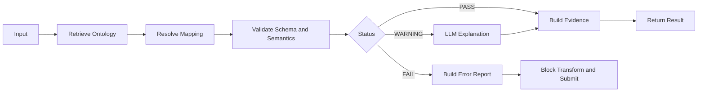

# k-mds 개발 지침

> Project: Korea Maritime Data Space  
> Repository Root: `k-mds`  
> Primary Profile: KR GHG  
> Reference Model: IMO Compendium on Facilitation and Electronic Business

## 1. 프로젝트 목적

이 저장소는 「스마트·자율운항선박-밸류체인 간 데이터 표준개발 및 서비스 설계」 국가연구개발과제의 일환으로, 선박과 육상 밸류체인 간 국제표준 기반 데이터 공유 및 상호운용성을 확보하기 위한 Korea Maritime Data Space(k-mds)를 개발한다.

k-mds는 IMO Compendium 참조 모델을 데이터 유형별 Domain, Dataset, Component, DataElement 및 ElementOccurrence로 구조화하고, 이를 기반으로 다음 기능을 제공한다.

1. IMO Compendium Dataset, DataElement 및 Technical Position 검색
2. 선박 플랫폼과 선박 탑재 장비 데이터의 IMO 표준 매핑
3. 한국선급 온실가스 검증 연계를 위한 공통 데이터 모델(KR GHG Canonical Payload) 생성 및 데이터 교환 검증
4. LangGraph 기반 Agent Skill 및 Tool 실행 제어
5. MCP 기반 규격서 지식 Resource와 검증 Tool 제공
6. 온실가스 검증 시스템 API Payload 변환 및 Dry-run 검증

본 시스템은 LLM이 환경규제 적합성을 직접 판정하거나 검증 결과를 자동 승인하는 시스템이 아니다.

LLM은 다음 보조 기능에만 사용한다.

- 온톨로지 및 규격서 검색
- 매핑 후보 추천
- 오류와 경고의 자연어 설명
- 사용자 검토 보고서 생성
- 결정론적 Skill 및 Tool 실행 순서의 오케스트레이션

다음 기능은 결정론적 Application Service, Skill 및 Rule Engine이 수행한다.

- 최종 데이터 매핑
- JSON Schema 및 Pydantic 검증
- IMO Code List 검증
- Technical Position 정합성 검증
- Business Rule 검증
- PASS, WARNING 또는 FAIL 상태 결정
- 온실가스 검증 시스템 API Payload 변환
- 검증 실패 시 후속 Transform 또는 Submit 차단

### 1.1 초기 PoC 적용 대상

초기 PoC에서는 다음 Source System을 대상으로 한다.

- 선박 플랫폼
  - BLUEONE
  - VesselLink
- 선박 탑재 장비 및 시스템
  - VDR
  - AMS

위 제품명과 시스템명은 초기 실증 범위를 식별하기 위한 것이다. k-mds Core Ontology, Application Service, LangGraph 및 MCP가 특정 공급사에 종속됨을 의미하지 않는다.

### 1.2 용어 사용 원칙

- `IMO Compendium`은 공식 국제 참조모델을 의미한다.
- `k-mds Core Ontology`는 해사 데이터 상호운용을 위한 공통 의미모델을 의미한다.
- `KR GHG Profile`은 k-mds Core Ontology 중 한국선급 온실가스 검증 업무에 필요한 Dataset, DataElement, ElementOccurrence, CodeList, BusinessRule 및 Mapping의 선택 집합을 의미한다.
- `KR GHG Canonical Payload`는 KR GHG Profile에 따라 생성되는 공통 데이터 교환 Payload를 의미한다.
- `온실가스 검증 시스템 Adapter`는 Canonical Payload를 대상 검증 시스템의 API Payload로 변환하는 외부 연계 모듈을 의미한다.
- 초기 온실가스 검증 시스템 Adapter는 KR GEARs 연계를 대상으로 한다.
- `approved`, `draft`, `review_required`, `unresolved`, `deprecated`는 표준 사실 또는 매핑의 관리상태를 의미한다.

### 1.3 LLM 사용 경계

LLM이 생성한 매핑 후보, 설명 또는 보고서는 검증 결과의 근거가 될 수 있으나, 그 자체로 표준 적합성 또는 환경규제 적합성을 확정하지 않는다.

모든 최종 결과에는 다음 항목이 포함되어야 한다.

- 적용한 FAL Version
- 적용한 Ontology Version
- 적용한 KR GHG Profile Version
- 실행한 Rule ID
- 참조한 Evidence
- PASS, WARNING 또는 FAIL 상태
- Human Review 필요 여부

---

## 2. 핵심 설계 원칙

### 2.1 Single Source of Truth

데이터 처리 흐름은 다음 순서를 따른다.

```text
IMO Compendium Excel 또는 HTML
    ↓
FAL Version별 원본 Snapshot
    ↓
정규화 데이터
    ↓
k-mds Core Ontology 및 Knowledge Graph
    ↓
Domain Profile 및 Mapping
    ↓
Application Service와 결정론적 Skill
    ↓
LangGraph Workflow 또는 MCP Service
    ↓
KR GHG Canonical Payload
    ↓
온실가스 검증 시스템 Adapter
```

### 2.2 원본 직접 사용 금지

- Skill, MCP Tool, LangGraph Node는 원본 Excel 또는 HTML을 직접 조회하지 않는다.
- 원본은 변환 스크립트만 읽을 수 있다.
- 실행 서비스는 정규화된 Ontology Snapshot만 조회한다.
- 공식 출처에서 확인되지 않은 IMO ID, 정의, Path, Format 또는 Code Value를 생성하지 않는다.
- 확인할 수 없는 값은 `unresolved` 또는 `review_required` 상태로 기록한다.

### 2.3 DataElement와 ElementOccurrence 분리

IMO Data Element와 Dataset 내 실제 사용 위치를 별도 객체로 관리한다.

- `DataElement`
  - IMO ID
  - 명칭
  - 정의
  - 데이터 형식
  - Representation Term
- `ElementOccurrence`
  - Dataset ID
  - Technical Position 또는 Path
  - Parent Component
  - Sequence
  - Cardinality
  - Usage
  - 적용 Business Rule

동일 IMO ID가 여러 Dataset이나 Path에 존재할 수 있으므로 하나의 IMO ID에 하나의 Path만 저장해서는 안 된다.

### 2.4 국제표준과 KR 확장 분리

- IMO 원본 사실은 `data/raw/`, 정규화된 공식 모델은 `data/normalized/`에 관리한다.
- 공통 의미모델은 `ontology/core/`와 `ontology/domains/`에 관리한다.
- 한국선급 업무 선택집합과 제약은 `ontology/profiles/kr-ghg/`에 관리한다.
- Source-to-IMO와 IMO-to-Target Mapping을 분리한다.
- KR GEARs 전용 로직은 Adapter에서만 구현한다.

### 2.5 생성 파일 직접 수정 금지

다음 폴더의 파일은 스크립트로 생성한다.

```text
data/normalized/
ontology/generated/
schemas/generated/
```

생성 파일을 직접 수정하지 않는다. 수정이 필요한 경우 Source Model, Mapping 또는 생성 스크립트를 수정한 후 전체 Build를 실행한다.

### 2.6 AI 지침 계층

AI Coding Assistant는 다음 우선순위로 지침을 적용한다.

1. Repository Root의 `AGENTS.md`
2. 변경 대상의 가장 가까운 상위 폴더에 있는 Local `AGENTS.md`
3. `.github/copilot-instructions.md` 등 도구별 연결 지침
4. 승인된 작업 Prompt
5. 현재 사용자 작업 요청

Local `AGENTS.md`는 Root 규칙을 완화하거나 무효화할 수 없으며, 해당 폴더에 필요한 추가 제약만 정의한다.

지침 간 충돌이 발생하면 더 엄격한 데이터 무결성, 보안, Evidence 및 검증 규칙을 적용하고 충돌 사실을 작업 결과에 기록한다.

핵심 경계 폴더에는 필요한 경우 Local `AGENTS.md`를 둔다.

```text
data/AGENTS.md
ontology/AGENTS.md
schemas/AGENTS.md
src/AGENTS.md
tests/AGENTS.md
```

모든 하위 폴더에 `_prompt.md`를 반복 생성하지 않는다. 도메인 고유 설명은 `domain.yaml`, Profile 고유 설명은 `profile.yaml`에 기록한다.

---

## 3. Repository 구조

```text
k-mds/
├── .github/
│   ├── copilot-instructions.md
│   └── workflows/
│       └── ci.yml
├── .vscode/
│   ├── extensions.json
│   ├── settings.json
│   ├── tasks.json
│   └── launch.json
├── docs/
│   ├── architecture.md
│   ├── ontology-guide.md
│   ├── mapping-guide.md
│   ├── mcp-guide.md
│   └── diagrams/
├── data/
│   ├── raw/
│   │   └── FAL50/
│   │       ├── IMO_Compendium.xlsx
│   │       ├── Readme.pdf
│   │       ├── Changes.pdf
│   │       └── source-manifest.yaml
│   ├── normalized/
│   │   └── FAL50/
│   │       ├── datasets.json
│   │       ├── elements.json
│   │       ├── occurrences.json
│   │       ├── code-lists.json
│   │       └── changes.json
│   └── samples/
│       ├── valid/
│       └── invalid/
├── ontology/
│   ├── core/
│   │   ├── model.yaml
│   │   ├── context.jsonld
│   │   └── shapes.ttl
│   ├── domains/
│   │   ├── common/
│   │   ├── vessel/
│   │   ├── voyage/
│   │   ├── port-call/
│   │   ├── cargo/
│   │   ├── crew/
│   │   ├── environment-ghg/
│   │   └── weather-ocean/
│   ├── profiles/
│   │   └── kr-ghg/
│   │       ├── profile.yaml
│   │       ├── selected-elements.yaml
│   │       ├── rules/
│   │       └── tests/
│   ├── mappings/
│   │   ├── source-to-imo/
│   │   │   ├── blueone.yaml
│   │   │   ├── vessellink.yaml
│   │   │   ├── vdr.yaml
│   │   │   └── ams.yaml
│   │   └── imo-to-target/
│   │       └── kr-gears.yaml
│   └── generated/
│       ├── imo-compendium.jsonld
│       └── imo-compendium.ttl
├── schemas/
│   ├── source/
│   │   ├── canonical_model.py
│   │   ├── mapping_model.py
│   │   └── validation_model.py
│   └── generated/
│       ├── kr-ghg.schema.json
│       ├── mapping.schema.json
│       └── openapi.yaml
├── src/
│   └── k_mds/
│       ├── models/
│       ├── services/
│       ├── skills/
│       ├── langgraph/
│       ├── mcp/
│       └── adapters/
├── scripts/
│   ├── inspect_excel.py
│   ├── normalize_compendium.py
│   ├── build_ontology.py
│   ├── generate_schemas.py
│   ├── compare_versions.py
│   └── validate_all.py
├── tests/
│   ├── unit/
│   ├── integration/
│   ├── contracts/
│   └── fixtures/
├── AGENTS.md
├── README.md
├── CHANGELOG.md
├── pyproject.toml
├── uv.lock
├── Makefile
└── .env.example
```

---

## 4. 폴더별 책임

### 4.1 `.github/`

Pull Request 및 CI를 관리한다.

최소 품질검증 항목:

- Python lint 및 type check
- Pydantic model test
- JSON Schema validation
- SHACL validation
- Mapping target 존재 여부
- MCP Tool contract test
- LangGraph PASS, WARNING, FAIL routing test
- Source Hash 및 FAL Version 검증

### 4.2 `.vscode/`

모든 개발자와 AI Coding Assistant가 동일 명령과 도구를 사용하도록 설정한다.

권장 확장 프로그램:

- Python
- Pylance
- Ruff
- YAML
- JSON
- Mermaid
- GitLens
- GitHub Copilot 또는 Gemini Code Assist

### 4.3 `docs/`

사람과 AI가 참조하는 설계 문서를 저장한다. 원본 Excel이나 PDF는 저장하지 않는다.

### 4.4 `data/`

- `raw`: 수정하지 않는 공식 원본 Snapshot
- `normalized`: 스크립트가 생성한 Git Diff 가능 JSON
- `samples`: 매핑 및 검증 테스트 Payload

### 4.5 `ontology/`

- `core`: 공통 Ontology Class, Relation, Context, SHACL Shape
- `domains`: 국제표준 기반 데이터 유형별 Dataset 및 Component
- `profiles`: 업무 목적별 선택집합과 추가 제약
- `mappings/source-to-imo`: Source System에서 IMO 모델로의 매핑
- `mappings/imo-to-target`: IMO 모델에서 Target System으로의 매핑
- `generated`: 자동 생성 JSON-LD와 Turtle

### 4.6 `schemas/`

Pydantic을 원천 모델로 사용한다.

```text
Pydantic Source
    ↓
JSON Schema
    ↓
OpenAPI
    ↓
MCP Input/Output Contract
```

생성된 JSON Schema와 OpenAPI는 직접 수정하지 않는다.

### 4.7 `src/k_mds/`

```text
models       핵심 객체 및 타입
services     검색, 매핑, 검증 Application Service
skills       Agent가 호출하는 결정론적 Skill
langgraph    State, Node, Router, Workflow
mcp          Resource, Tool, Prompt, Server
adapters     KR GEARs, IDS, LLM 외부 연계
```

### 4.8 `scripts/`

```text
inspect_excel.py
    ↓
normalize_compendium.py
    ↓
build_ontology.py
    ↓
generate_schemas.py
    ↓
validate_all.py
```

### 4.9 `tests/`

- `unit`: 함수와 Skill 테스트
- `integration`: LangGraph, MCP 및 Repository 연계 테스트
- `contracts`: MCP와 OpenAPI 입출력 계약 테스트
- `fixtures`: 정상, 경고, 실패 데이터

---

## 5. 도메인 및 Profile 구조

### 5.1 도메인 폴더 표준

```text
ontology/domains/environment-ghg/
├── domain.yaml
├── datasets/
│   ├── noon-report.yaml
│   └── emission-report.yaml
├── components/
│   ├── vessel.yaml
│   ├── voyage.yaml
│   ├── fuel-consumption.yaml
│   └── emissions.yaml
├── rules/
│   ├── required-fields.yaml
│   ├── datatype-rules.yaml
│   └── value-rules.yaml
└── tests/
    └── competency-questions.yaml
```

모든 도메인은 동일 구조를 사용한다.

### 5.2 KR GHG Profile 구조

```text
ontology/profiles/kr-ghg/
├── profile.yaml
├── selected-elements.yaml
├── rules/
│   ├── canonical-payload.yaml
│   ├── validation-rules.yaml
│   └── review-policy.yaml
└── tests/
    └── competency-questions.yaml
```

`environment-ghg`는 국제 도메인이고 `kr-ghg`는 한국선급 업무 Profile이다. 두 개념을 혼합하지 않는다.

---

## 6. 핵심 모델과 식별자

```yaml
entities:
  Dataset:
    description: IMO 데이터셋 또는 메시지 단위
  Component:
    description: Dataset을 구성하는 계층적 업무 컴포넌트
  DataElement:
    description: IMO ID로 식별되는 데이터 요소
  ElementOccurrence:
    description: 특정 Dataset과 Technical Position에서의 DataElement 사용
  CodeList:
    description: DataElement 값 영역을 제한하는 코드 목록
  BusinessRule:
    description: 필수, 조건, 범위 및 상호 의존성 검증 규칙
```

```yaml
identifier_policy:
  dataset: "urn:imo:dataset:{dataset-id}:{fal-version}"
  component: "urn:imo:component:{component-id}:{fal-version}"
  element: "urn:imo:element:{imo-id}"
  occurrence: "urn:imo:occurrence:{dataset-id}:{path-hash}:{fal-version}"
  code_list: "urn:imo:codelist:{code-list-id}:{fal-version}"
  business_rule: "urn:kr:rule:{profile}:{rule-id}:{version}"
```

---

## 7. Source Manifest 규칙

FAL 버전별 원본 폴더에는 반드시 `source-manifest.yaml`을 둔다.

```yaml
standard:
  name: IMO Compendium on Facilitation and Electronic Business
  fal_version: FAL50
  status: approved

source:
  website: "https://imocompendium.imo.org/public/IMO-Compendium/Current/index.htm"

files:
  - name: IMO_Compendium.xlsx
    sha256: "<generated-value>"
  - name: Readme.pdf
    sha256: "<generated-value>"
  - name: Changes.pdf
    sha256: "<generated-value>"

ingestion:
  parser_version: "0.1.0"
  imported_at: null
  status: pending
```

규칙:

- `Current` URL만으로 버전을 식별하지 않는다.
- FAL 승인 버전과 파일 Hash를 함께 기록한다.
- 파일 변경 시 Hash 불일치를 Build Error로 처리한다.
- FAL 신규 버전은 기존 폴더를 덮어쓰지 않고 새 폴더로 추가한다.

---

## 8. Mapping 파일 규격

모든 Mapping은 YAML을 사용한다.

```yaml
mapping_id: vessellink-noon-report-v0.1
mapping_type: source-to-imo
source_system: VESSELLINK
report_type: NOON
fal_version: FAL50
target_profile: kr-ghg-v0.1

fields:
  - source_path: "$.imo_no"
    target_imo_id: "IMO0140"
    target_occurrence_id: null
    canonical_path: "ship.imoNumber"
    transformation: string
    required: true
    status: approved
    evidence:
      source_file: IMO_Compendium.xlsx
      source_sheet: null
      source_row: null

  - source_path: "$.co2_ttw"
    target_imo_id: null
    target_occurrence_id: null
    canonical_path: "emissions.totalCO2TankToWake"
    transformation: decimal
    required: false
    status: unresolved
    evidence: null
```

규칙:

- 확인되지 않은 IMO ID를 임의로 기입하지 않는다.
- Target은 가능하면 `target_occurrence_id`까지 지정한다.
- 근거 없는 매핑은 `approved`가 될 수 없다.
- Technical Position을 확인하지 못한 항목은 `review_required`로 기록한다.
- Canonical Path와 Target System Path를 혼합하지 않는다.
- 단위 변환이 필요한 경우 검증된 Transformation Rule ID를 지정한다.
- 모든 매핑 변경에는 정상, 누락 및 타입 오류 Fixture가 필요하다.

---

## 9. Application Service 경계

MCP와 LangGraph는 동일한 Application Service를 사용한다.

```text
MCP Resource ─┐
MCP Tool ─────┼─> Application Service ─> Ontology Repository
LangGraph ────┘                         ├> Mapping Repository
                                      └> Validation Engine
```

금지 의존성:

```text
MCP Tool -> LangGraph Node
LangGraph Node -> MCP Tool
Skill -> Raw Excel 또는 HTML
MCP Resource -> Raw Excel 또는 HTML
LLM -> PASS, WARNING 또는 FAIL 최종 결정
Core Service -> KR GEARs API Schema 직접 의존
```

허용 의존성:

```text
MCP Tool -> Application Service
LangGraph Node -> Application Service
Application Service -> Repository
Application Service -> Validation Engine
Target Adapter -> 외부 시스템 API Schema
```

---

## 10. Skill 개발 규칙

초기 Skill은 다음 다섯 개로 제한한다.

```text
ontology_search
mapping_resolve
schema_validate
semantic_validate
evidence_build
```

Skill 공통 응답 형식:

```json
{
  "status": "FAIL",
  "humanReviewRequired": true,
  "data": {},
  "errors": [
    {
      "severity": "ERROR",
      "code": "VAL_001",
      "message": "IMO 번호 형식이 올바르지 않습니다.",
      "ruleId": "urn:kr:rule:kr-ghg:format-imo-number:0.1.0",
      "relatedRuleIds": [],
      "path": "$.ship.imoNumber",
      "actualValue": "<masked-or-hashed-value>",
      "expected": "7-digit IMO number",
      "evidenceRefs": ["ev-001"]
    }
  ],
  "warnings": [],
  "evidence": [
    {
      "evidenceId": "ev-001",
      "falVersion": "FAL50",
      "ontologyVersion": "0.1.0",
      "profileVersion": "kr-ghg-0.1.0",
      "resourceUri": "imo://elements/IMO0140",
      "sourceFile": "IMO_Compendium.xlsx",
      "sourceHash": "<sha256>"
    }
  ]
}
```

`errors`와 `warnings`는 동일한 ValidationFinding 구조를 사용한다. 각 Finding은 Primary Rule인 `ruleId`를 가져야 하며, 관련 규칙이 있는 경우 `relatedRuleIds`에 기록한다. Evidence는 `evidenceId`로 식별하고 Finding의 `evidenceRefs`에서 참조한다.

`actualValue`는 비민감 데이터에만 허용한다. 데이터 분류에 따라 다음 정책을 적용한다.

```yaml
finding_value_policy:
  public: raw_value_allowed
  internal: masked_value_only
  confidential: hash_only
  secret: never_log
```

상태 불변조건은 Pydantic Validator로 강제한다.

```yaml
status_invariants:
  PASS:
    errors_must_be_empty: true
    warnings_must_be_empty: true
    human_review_required: false

  WARNING:
    errors_must_be_empty: true
    warnings_must_not_be_empty: true
    human_review_required: true

  FAIL:
    errors_must_not_be_empty: true
    human_review_required: true
    transform_allowed: false
    submit_allowed: false
```

모든 Skill은 다음 조건을 만족해야 한다.

- 동일 입력에 동일 결과를 반환한다.
- 오류를 숨기지 않는다.
- Evidence와 적용 버전을 반환한다.
- LLM 없이 단독 테스트할 수 있다.
- 검증 실패 시 후속 Transform 또는 Submit을 차단한다.
- WARNING 또는 `review_required`는 Human Review를 요구한다.
- `ValidationFinding`, `Evidence`, `SkillResult`는 Pydantic 모델로 정의한다.
- `SkillResult`의 PASS, WARNING, FAIL 상태 불변조건은 `model_validator`로 강제한다.
- `PASS` 결과에 Error 또는 Warning을 포함하지 않는다.
- Finding과 Evidence의 다대다 관계는 `evidenceId`와 `evidenceRefs`로 연결한다.

---

## 11. LangGraph 구조와 상태

```text
src/k_mds/langgraph/
├── state.py
├── nodes/
│   ├── retrieve.py
│   ├── map_payload.py
│   ├── validate.py
│   ├── explain.py
│   └── build_evidence.py
├── routers.py
└── workflow.py
```



State 필수 필드:

```yaml
state_required_fields:
  - correlation_id
  - fal_version
  - ontology_version
  - profile_version
  - status
  - human_review_required
  - evidence
```

규칙:

- 검증 노드는 LLM을 호출하지 않는다.
- LLM은 WARNING 또는 FAIL 결과의 설명에만 사용한다.
- FAIL 상태는 Transform 또는 Submit Node로 이동할 수 없다.
- WARNING 상태는 Human Review 없이 운영 제출할 수 없다.

---

## 12. MCP 구조

```text
src/k_mds/mcp/
├── server.py
├── resources/
│   ├── datasets.py
│   ├── elements.py
│   ├── occurrences.py
│   ├── profiles.py
│   └── changes.py
├── tools/
│   ├── search.py
│   ├── mapping.py
│   ├── validation.py
│   └── kr_gears.py
└── contracts/
    ├── inputs.py
    └── outputs.py
```

MCP Resource:

```text
imo://releases/{falVersion}
imo://datasets/{datasetId}
imo://elements/{imoId}
imo://occurrences/{occurrenceId}
imo://changes/{fromVersion}/{toVersion}
krghg://profiles/{profileVersion}
```

MCP Tool:

```text
search_elements
resolve_occurrences
resolve_mapping
validate_payload
compare_versions
transform_kr_gears_dry_run
```

PoC 단계에서는 실제 운영계 제출 Tool을 등록하거나 구현하지 않는다.

---

## 13. VSCode Tasks 및 Make 명령

`.vscode/tasks.json`은 최소 다음 작업을 제공한다.

```json
{
  "version": "2.0.0",
  "tasks": [
    {
      "label": "IMO: Inspect Excel",
      "type": "shell",
      "command": "uv run python scripts/inspect_excel.py --release FAL50",
      "problemMatcher": []
    },
    {
      "label": "IMO: Build All",
      "type": "shell",
      "command": "make build",
      "group": {"kind": "build", "isDefault": true},
      "problemMatcher": []
    },
    {
      "label": "IMO: Validate All",
      "type": "shell",
      "command": "make validate",
      "group": "test",
      "problemMatcher": []
    },
    {
      "label": "Test: All",
      "type": "shell",
      "command": "make test",
      "group": "test",
      "problemMatcher": []
    },
    {
      "label": "MCP: Run Server",
      "type": "shell",
      "command": "uv run python -m k_mds.mcp.server",
      "isBackground": true,
      "problemMatcher": []
    },
    {
      "label": "FAL: Compare Versions",
      "type": "shell",
      "command": "uv run python scripts/compare_versions.py --from FAL49 --to FAL50",
      "problemMatcher": []
    }
  ]
}
```

표준 명령:

```text
make setup
make inspect
make normalize
make ontology
make schemas
make validate
make test
make build
make run-mcp
make compare FROM=FAL49 TO=FAL50
```

AI Coding Assistant도 개별 Python 명령보다 Make 명령을 우선 사용한다.

---

## 14. Git 운영 규칙

Branch:

```text
main
feat/fal50-weather-ocean
feat/mcp-element-search
feat/kr-gears-mapping
fix/technical-path-parser
```

장기간 유지하는 `develop` Branch는 사용하지 않는다.

Tag:

```text
imo-fal50.0
imo-fal50.1
k-mds-0.1.0
mcp-server-0.1.0
kr-ghg-profile-0.1.0
```

Commit:

```text
feat(ontology): add weather-ocean dataset
feat(profile): add kr-ghg selected elements
feat(mcp): add occurrence resolution tool
feat(mapping): add VesselLink noon mapping
fix(parser): preserve repeated technical positions
test(validation): add invalid IMO number fixture
docs(architecture): update ontology flow
```

Pull Request 필수 항목:

- 변경 목적
- 영향 Domain 및 Profile
- 사용한 FAL Version
- 원본 근거 및 Evidence
- 생성 파일 목록
- 테스트 결과
- Breaking Change 여부
- Human Review 필요 여부

---

## 15. AI 바이브 코딩 공통 지시

AI Coding Assistant는 작업 전후에 다음을 준수한다.

1. Repository Root가 `k-mds`인지 확인한다.
2. 변경 대상이 원본, Source Model, 생성물 또는 실행 코드 중 어디인지 식별한다.
3. 해당 폴더의 기존 Naming 및 Contract를 확인한다.
4. IMO 표준 사실과 KR Profile 확장 정보를 구분한다.
5. 공식 자료에서 확인되지 않은 값은 생성하지 않는다.
6. Source Model을 수정하고 생성 스크립트를 실행한다.
7. 실행 코드, Mapping Rule, Validation Rule, MCP Contract 또는 LangGraph Routing의 동작을 추가하거나 변경하는 경우 TDD를 적용한다.
   - 변경할 동작의 Acceptance Criteria를 먼저 정의한다.
   - Unit Test, Contract Test 또는 Routing Test를 구현 코드보다 먼저 작성한다.
   - 신규 또는 변경 동작의 테스트가 의도한 이유로 실패하는지 확인한다.
   - 최소 구현으로 테스트를 통과시킨 후 중복 코드와 구조를 리팩터링한다.
   - 테스트 실패를 만들기 위해 기존 정상 Test, Fixture 또는 Production Code를 의도적으로 훼손하지 않는다.
8. 문서, 원본 Snapshot 또는 자동 생성 산출물만 변경하는 작업에는 실패 테스트 선행을 강제하지 않지만 관련 Validation과 Regression Test를 실행한다.
9. PASS, WARNING, FAIL 시나리오와 상태 불변조건을 모두 검증한다.
10. 관련 문서, CHANGELOG 및 Mermaid Diagram을 갱신한다.
11. `make build`, `make validate`, `make test` 결과를 확인한다.

---

## 16. AI 작업 지시 템플릿

### 16.1 새로운 도메인 추가

```text
FAL50 원본을 기준으로 weather-ocean 도메인을 추가하라.

요구사항:
1. data/raw 파일은 수정하지 않는다.
2. Dataset, Component, DataElement, ElementOccurrence를 분리한다.
3. 각 ElementOccurrence에 Technical Position을 보존한다.
4. ontology/domains/weather-ocean 아래의 Source YAML을 작성한다.
5. JSON-LD와 TTL은 생성 스크립트로 생성한다.
6. 최소 3개의 Competency Question을 작성한다.
7. 정상 및 오류 Test Fixture를 작성한다.
8. 출처에서 확인되지 않은 IMO ID, Path 또는 Format은 unresolved로 기록한다.
9. make build와 make test가 통과하도록 한다.
```

### 16.2 KR GHG Profile 변경

```text
KR GHG Profile에 환경규제 보고용 DataElement와 ElementOccurrence 선택집합을 추가하라.

요구사항:
1. IMO Core Ontology를 직접 변경하지 않는다.
2. ontology/profiles/kr-ghg 아래의 Source YAML만 수정한다.
3. Profile Version과 상태를 갱신한다.
4. 선택 근거와 적용 Rule ID를 기록한다.
5. 확인되지 않은 선택 항목은 review_required로 기록한다.
6. Competency Question과 Profile Regression Test를 추가한다.
```

### 16.3 MCP Tool 추가

```text
IMO ID로 DataElement를 검색하고 Dataset별 ElementOccurrence를 반환하는 MCP Tool resolve_occurrences를 구현하라.

요구사항:
1. MCP Tool은 Application Service만 호출한다.
2. Excel 또는 JSON 파일을 Tool에서 직접 열지 않는다.
3. 입출력은 Pydantic Contract를 사용한다.
4. 출력에는 FAL Version, Dataset ID, Technical Position 및 Evidence를 포함한다.
5. 검색 결과가 없는 경우 빈 배열과 WARNING을 반환한다.
6. Unit Test와 MCP Contract Test를 작성한다.
7. 생성 Schema를 직접 수정하지 않는다.
```

### 16.4 LangGraph Node 추가

```text
매핑된 IMO ID와 ElementOccurrence Technical Position을 검증하는 LangGraph Node validate_semantic_mapping을 구현하라.

요구사항:
1. 결정론적 Application Service를 사용한다.
2. LLM을 호출하지 않는다.
3. PASS, WARNING, FAIL 상태를 반환한다.
4. FAIL 상태는 KR GEARs Transform으로 이동할 수 없다.
5. WARNING 상태에는 human_review_required=true를 설정한다.
6. 결과에 Rule ID와 Evidence를 포함한다.
7. 세 가지 상태의 Routing Test를 작성한다.
```

### 16.5 Source Mapping 추가

```text
VesselLink Noon Report의 Source Field를 KR GHG Profile에 매핑하라.

요구사항:
1. Source Field별 IMO DataElement와 ElementOccurrence를 조회한다.
2. 확인된 항목만 approved로 기록한다.
3. Technical Position을 확인할 수 없는 항목은 review_required로 기록한다.
4. Canonical Path와 KR GEARs Target Path를 분리한다.
5. 단위 변환이 필요한 필드는 Transformation Rule ID를 지정한다.
6. 정상, 누락 및 타입 오류 Test Fixture를 작성한다.
7. 매핑 성공률을 임의로 작성하지 않는다.
```

---

## 17. Definition of Done

```yaml
definition_of_done:
  source:
    - source_reference_present
    - source_hash_present
    - fal_version_present

  ontology:
    - data_element_and_occurrence_separated
    - technical_path_preserved
    - core_and_profile_separated
    - generated_artifacts_updated

  code:
    - lint_passed
    - type_check_passed
    - unit_tests_passed

  tdd_for_behavior_or_contract_changes:
    - acceptance_criteria_defined
    - behavior_change_has_test
    - new_test_failed_for_expected_reason
    - implementation_makes_test_pass
    - regression_tests_passed

  validation:
    - pass_case_tested
    - warning_case_tested
    - fail_case_tested
    - human_review_policy_tested
    - status_invariants_enforced_by_pydantic
    - finding_and_evidence_linkage_tested

  mcp:
    - input_contract_defined
    - output_contract_defined
    - evidence_included
    - contract_test_passed

  documentation:
    - changelog_updated
    - architecture_or_diagram_updated_when_required

  safety:
    - no_invented_imo_values
    - no_secrets_in_repository
    - production_submission_disabled
```

---

## 18. 금지 사항

- `k-mds` 이외의 Repository Root를 새로 생성하거나 사용
- 원본 Excel, HTML 또는 PDF 수정
- 검증되지 않은 IMO ID, 정의, Technical Position, Format 또는 Code Value 생성
- 하나의 IMO ID에 단일 Technical Position만 저장
- IMO Core Ontology와 KR GHG Profile 확장 혼합
- Source-to-IMO와 IMO-to-Target Mapping 혼합
- 생성된 JSON-LD, TTL, JSON Schema 또는 OpenAPI 직접 수정
- LangGraph Node 또는 MCP Tool에서 원본 파일 직접 조회
- MCP Tool에 Application Service 업무 로직 중복 구현
- LLM 응답만으로 규제 PASS, WARNING 또는 FAIL 최종 결정
- PASS 상태에 Error 또는 Warning 포함
- WARNING 상태에서 `human_review_required=false` 설정
- FAIL 상태에서 Error 없이 결과 반환
- 민감정보, 기밀정보 또는 비밀정보를 Validation Finding의 `actualValue`에 원문 저장
- FAIL 상태에서 Transform 또는 Submit 실행
- WARNING 상태에서 Human Review 없이 운영 제출
- Source Hash, FAL Version, Ontology Version 또는 Profile Version 없는 결과 배포
- 비밀번호, Token 또는 API Key를 Git에 Commit
- 초기 PoC에서 실제 KR GEARs 운영계 제출 기능 구현 또는 활성화

---

## 19. 초기 구현 범위

활성 Domain:

```text
common
vessel
voyage
environment-ghg
```

활성 Profile:

```text
kr-ghg
```

활성 Skill:

```text
ontology_search
mapping_resolve
schema_validate
semantic_validate
evidence_build
```

활성 MCP Tool:

```text
search_elements
resolve_occurrences
resolve_mapping
validate_payload
transform_kr_gears_dry_run
```

LangGraph Workflow:

```text
retrieve
    ↓
map
    ↓
validate
    ↓
build evidence
    ↓
return result
```

초기 범위 제외:

```text
실제 KR GEARs 운영계 제출
환경규제 적합성 자동 승인
자율 Mapping 자동 확정
전체 IMO Domain 일괄 구현
운영용 사용자 권한 관리
```

---

## 20. 최종 개발 원칙

k-mds는 특정 공급사, 선박 플랫폼 또는 단일 환경규제 서비스에 종속되지 않는 해사 데이터 상호운용 기반으로 설계한다. IMO Compendium은 공식 참조모델, k-mds Core Ontology는 공통 의미계층, KR GHG는 첫 번째 업무 Profile, KR GEARs는 첫 번째 Target Adapter로 관리한다.

표준 사실, 업무 해석, 시스템 매핑, 실행 로직 및 생성 산출물의 경계를 유지하고, 모든 결과에 Version과 Evidence를 포함한다. Root `AGENTS.md`를 Master Contract로 사용하며 Local `AGENTS.md`는 해당 경계 폴더의 추가 제약만 정의한다.
