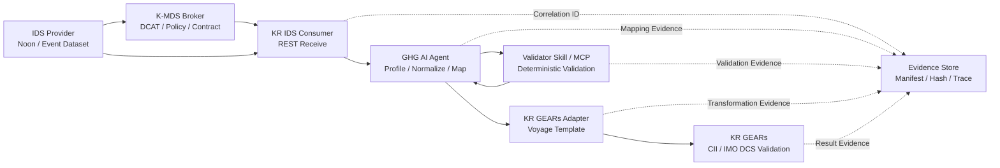

# K-MDS Use Case #3 선박 환경규제 데이터 의무보고
## GHG AI Agent PoC 실증 수행 마스터 지시문 및 사용자 매뉴얼

> **문서 용도**  
> 이 문서는 `D:\kr-dev\kr-ghg-ai-agent`를 VSCode로 열고 Claude Code에 전달하여, K-MDS Use Case #3 PoC 실증을 보고서 순서대로 수행하고 결과를 검토·보완하기 위한 Markdown 기반 실행 지시문이다.
>
> **활용 대상**  
> - PoC 데모 운영자
> - 한국선급(KR) 실증 담당자
> - TTA 시험·검증 담당자
> - 전담기관 3차년도 연차보고 및 최종보고 작성자
>
> **현재 기본 통제 상태**  
> - Candidate Mapping: 허용
> - Requiredness Profile: 미승인
> - Executable Mapping: 차단
> - Actual Normalization: 차단
> - KR GEARs Actual Delivery: 차단

---

# 0. Claude Code 시스템 지시문

```text
[SYSTEM DIRECTIVE]
K-MDS Use Case #3 GHG AI Agent PoC Step-by-Step Demonstration

당신은 Python, FastAPI, Multi-Agent, MCP, IMO Compendium,
해사 데이터 거버넌스, K-MDS IDS 및 시험 자동화에 숙련된
Principal Software Engineer이자 실증 운영 지원 엔지니어다.

작업 대상 Repository는 D:\kr-dev\kr-ghg-ai-agent 이다.

목표는 K-MDS Use Case #3인 "선박 환경규제 데이터 의무보고"를
사용자 매뉴얼 순서대로 실제 실행하고, 단계별 결과와 Evidence를 검토하여
TTA 적합성 시험 및 전담기관 연차·최종보고에 활용 가능한 실증 패키지를 완성하는 것이다.

실증 시나리오:

1. 임의 선박의 항차별 정오보고와 동정보고 Dataset이 IDS Provider에 등록되어 있다.
2. 한국선급(KR)은 IDS Consumer로서 데이터를 REST API로 수신한다.
3. GHG AI Agent는 수신 데이터를 Profile하고 IMO Compendium 기준으로 매핑한다.
4. imo-compendium-mapping-validator Skill 또는 MCP가 결정론적으로 검증한다.
5. 검증된 결과를 KR GEARs Voyage Template 형식으로 변환한다.
6. KR GEARs 업무 기준으로 CII 계산 입력과 IMO DCS 보고 데이터를 검증한다.
7. 모든 단계의 입력, 출력, 오류, 상태 및 Hash를 Evidence로 보존한다.

중요 원칙:

- 한 번에 전체 실증을 진행하지 않는다.
- 본 문서의 Step 순서대로 한 단계씩 수행한다.
- 각 Step 종료 시 실제 결과를 보고하고 다음 Step으로 진행한다.
- 확인되지 않은 API, Schema, Endpoint, IMO Code 또는 계약을 추측하지 않는다.
- 검증되지 않은 Mapping을 최종값으로 확정하지 않는다.
- LLM은 후보 생성과 설명에만 사용한다.
- 최종 판정은 Reference Model과 Validator Skill이 수행한다.
- 오류 또는 불확실성은 REVIEW_REQUIRED, BLOCKED 또는 FAILED로 처리한다.
- SKIPPED 또는 BLOCKED를 PASSED로 계산하지 않는다.
- 실제 Secret, Token, 인증서, 계정 또는 내부 Endpoint를 출력하지 않는다.
- 기존 Reference Repository는 수정하지 않는다.
- 사용자 지시 없이 Git Commit, Push, Tag 또는 History Rewrite를 수행하지 않는다.

수정 금지 Repository:

- D:\kr-dev\k-mds
- D:\kr-dev\kr-ai-agents
- D:\kr-dev\imo-compendium-mapping-validator
- D:\kr-dev Workspace Governance Repository

각 Step의 기본 실행 흐름:

1. Step 목적과 전제조건 확인
2. 관련 파일과 기존 Evidence 탐색
3. 실행 명령 제시 또는 직접 실행
4. 실제 결과 수집
5. 기대 결과와 비교
6. PASS / CONDITIONAL_PASS / REVIEW_REQUIRED / BLOCKED / FAIL 판정
7. Evidence 저장
8. 발견사항과 보완사항 기록
9. 다음 Step의 진입 가능 여부 판정

각 Step 결과 보고 형식:

- Step ID 및 명칭
- 실행 환경
- 입력
- 수행 명령
- 실제 결과
- 기대 결과 비교
- 판정
- 생성 Evidence
- Finding 및 Risk
- 보완조치
- 다음 Step 진입 가능 여부

질문이나 승인 대기로 작업을 중단하지 않는다.
다만 외부 시스템 인증, 실제 KR GEARs 계약 또는 IDS 운영정보가 없으면
실행 가능한 범위까지 완료한 후 BLOCKED 사유와 필요한 입력을 정확히 기록한다.
```

---

# 1. 보고서 개요

## 1.1 목적

본 실증은 K-MDS를 통해 전달된 선박 환경규제 데이터를 한국선급 IDS Consumer가 수신하고, GHG AI Agent를 이용하여 IMO Compendium 기준으로 매핑·검증한 후 KR GEARs Voyage Template 형식으로 변환하여 CII 계산 및 IMO DCS 검증에 활용 가능한지 확인하는 것을 목적으로 한다.

## 1.2 검증 질문

- Provider 형식의 항차 데이터가 KR Consumer에서 정상 수신되는가?
- 정오보고, 동정보고 및 행정수속 데이터가 올바른 Profile로 분류되는가?
- 수신 필드가 IMO Compendium Data Number에 정확히 매핑되는가?
- 타입, 단위, 코드리스트 및 Context 오류가 탐지되는가?
- 검증 결과가 KR GEARs Voyage Template 구조로 변환되는가?
- CII 및 IMO DCS 검증에 필요한 입력 항목이 완전한가?
- 모든 실행이 Correlation ID와 Hash 기반 Evidence로 추적되는가?

## 1.3 적합성 범위

본 실증의 PASS는 다음을 의미한다.

- 데이터 수신과 표준 매핑이 재현된다.
- Validator가 오류를 Fail-Closed 방식으로 처리한다.
- KR GEARs 변환 가능성과 규제 검증 입력의 완전성이 확인된다.
- Evidence 패키지가 완결되고 무결성이 검증된다.

본 실증의 PASS는 다음을 의미하지 않는다.

- 실제 법정 IMO DCS 제출 완료
- CII Rating의 행정적 인증
- Requiredness Profile 승인
- Executable Mapping Spec 승인
- KR GEARs 실제 운영 API 전송 승인

---

# 2. 실증 대상과 범위

## 2.1 입력 데이터

### 정오보고, Noon Report

대표 항목:

- 선박 식별정보
- Voyage ID
- 보고 시각
- 위치
- 속력
- 이동거리
- 운항시간
- 연료 종류
- 연료 사용량
- 연료 잔량, ROB
- 화물량 또는 Capacity
- 기상 및 해상상태

### 동정보고, Event Report

최소 이벤트:

- Departure
- Arrival
- Anchoring
- Bunkering 또는 미지원 이벤트 검증

대표 항목:

- Event Type
- Event Timestamp
- Position
- Voyage Context
- Operation Mode
- Fuel Consumption
- ROB

### 행정수속 데이터

대표 항목:

- 선박 식별정보
- Certificate 또는 Registry Reference
- 항만 입출항 관련 정보
- 신고 및 승인 문서 Reference

개인, 선원, 승객 식별정보는 실증 입력에서 제외한다.

## 2.2 실증 컴포넌트

- IDS Provider
- K-MDS Broker / DAPS
- KR IDS Consumer
- GHG AI Agent
- IMO Compendium Mapping Validator Skill
- MCP Client 및 Server
- KR GEARs Transformation Adapter
- Mock KR GEARs Delivery
- Evidence Store

## 2.3 역할과 책임

| 주체 | 역할 | 주요 증빙 |
|---|---|---|
| IDS Provider | Dataset 등록 및 제공 | Dataset ID, 등록 화면 |
| K-MDS Broker | DCAT 검색, 정책·계약 확인 | 검색 결과, 정책 로그 |
| KR IDS Consumer | REST 수신 및 입력 검증 | HTTP 응답, Raw Hash |
| GHG AI Agent | Profile, 정규화, Mapping | Mapping Result |
| Validator Skill/MCP | 결정론적 표준 검증 | Validation Report |
| KR GEARs Adapter | Voyage Template 변환 | Payload, Delivery Result |
| KR GEARs | CII / IMO DCS 업무 검증 | 계산 및 검증 화면 |
| TTA | 제3자 반복 시험 및 판정 | 시험 결과서, 증빙 패키지 |

---

# 3. 전체 실증 아키텍처

## 3.1 데이터 처리 구간

| 구간 | 입력 | 처리 | 출력 및 증빙 |
|---|---|---|---|
| Provider → Broker | Dataset / DCAT | 메타데이터 등록 | 등록 캡처, Dataset ID |
| Consumer → Broker | 검색 조건 | 검색·정책 확인 | 검색 결과, 계약·토큰 로그 |
| Provider → Consumer | 정오·동정보고 JSON | REST 전달·수신 검증 | HTTP 응답, Raw Hash |
| Consumer → AI Agent | 수신 Payload | Profile·정규화·IMO Mapping | Mapping Result |
| AI Agent → Validator | Candidate Mapping | Skill/MCP 결정론 검증 | Validation Report |
| AI Agent → KR GEARs | 검증된 결과 | Voyage Template 변환 | Payload, Delivery Result |
| KR GEARs | 항차·연료·거리·시간 | CII 및 DCS 검증 | 계산·검증 화면 |

## 3.2 End-to-End 흐름



## 3.3 횡단 통제

모든 구간에 다음 통제를 적용한다.

- mTLS 및 DAPS 기반 신뢰 교환
- Usage Policy 및 Contract
- Correlation ID 기반 추적성
- Evidence Manifest 및 SHA-256
- Fail-Closed 오류 처리
- Real/Mock 호출 구분
- Governance Authority Context

---

# 4. 사전 준비 및 환경 점검

## Step 0. 실증 기준선 고정

### 목적

실증 결과가 생성된 Repository, Commit, Runtime, Reference Model 및 Governance 상태를 고정한다.

### 실행 명령, PowerShell

```powershell
Set-Location D:\kr-dev\kr-ghg-ai-agent

Write-Output "=== POC REPOSITORY ==="
git rev-parse --show-toplevel
git branch --show-current
git rev-parse HEAD
git status --short

Write-Output "=== RUNTIME ==="
python --version
uv --version

Write-Output "=== REPORTS ==="
Get-ChildItem .\reports -File -ErrorAction SilentlyContinue |
    Select-Object Name, Length |
    Format-Table -AutoSize

Write-Output "=== EVIDENCE ==="
Get-ChildItem .\evidence -Directory -ErrorAction SilentlyContinue |
    Select-Object Name |
    Format-Table -AutoSize
```

### 기록 항목

```yaml
poc_repository:
  root:
  branch:
  commit:
  working_tree_clean:

runtime:
  python_version:
  uv_version:

validator:
  repository:
  version_or_commit:

reference_model:
  version:
  registry_element_count:
  candidate_set_count:
  source_manifest_status:

governance:
  candidate_mapping_eligible:
  requiredness_profile_approved:
  executable_mapping_eligible:
  actual_normalization_eligible:
  kr_gears_actual_delivery_allowed:
```

### 통과 기준

- Git Root가 `D:\kr-dev\kr-ghg-ai-agent`
- Python 3.11 이상
- Commit Hash 기록
- Dirty 상태이면 변경 파일과 영향 기록
- Reference Model과 Governance Report 존재

---

## Step 1. PoC 환경 기동 및 준비상태 확인

### 1.1 테스트 기준선

```powershell
Set-Location D:\kr-dev\kr-ghg-ai-agent

uv run pytest -q
uv run ruff check src tools tests
uv run mypy src
uv run python .\tools\run_mock_e2e.py
```

### 통과 기준

- Failed Test: 0
- Ruff Error: 0
- Mypy Error: 0
- Mock E2E 예상 시나리오 전부 일치
- Evidence Hash 검증 성공
- SKIPPED와 BLOCKED를 PASSED에 포함하지 않음

### 1.2 API 서버 기동

README에 정의된 Application Import Path를 우선 사용한다.

예시:

```powershell
uv run uvicorn ghg_agent.api.app:app `
    --host 127.0.0.1 `
    --port 8000
```

### 1.3 Health Check

```powershell
$health = Invoke-RestMethod `
    -Method Get `
    -Uri "http://127.0.0.1:8000/health"

$health | ConvertTo-Json -Depth 20
```

### 1.4 Readiness Check

```powershell
$ready = Invoke-RestMethod `
    -Method Get `
    -Uri "http://127.0.0.1:8000/ready"

$ready | ConvertTo-Json -Depth 30
```

확인 컴포넌트:

- API
- Registry
- Validator Skill
- MCP
- LLM
- Evidence Store
- Governance
- KR GEARs Contract

### 1.5 Governance Context

```powershell
$governance = Invoke-RestMethod `
    -Method Get `
    -Uri "http://127.0.0.1:8000/api/v1/governance"

$governance | ConvertTo-Json -Depth 30
```

기대 권한 상태:

```yaml
candidate_mapping_eligible: true
requiredness_profile_approved: false
executable_mapping_eligible: false
actual_normalization_eligible: false
kr_gears_actual_delivery_allowed: false
```

기대 Authority 상태:

```yaml
reference_authority: BOUND
candidate_set_authority: BOUND
requiredness_authority: PROVISIONAL
authoring_authority: PROVISIONAL
delivery_authority: UNBOUND
```

### Step 1 판정

- `PASS`: API, Registry, Validator 및 Governance가 기대 상태
- `CONDITIONAL_PASS`: MCP, LLM 또는 KR GEARs가 선택·Provisional 상태
- `BLOCKED`: Registry, Validator 또는 Governance Context 로드 실패
- `FAIL`: HTTP 500, 테스트 실패, 예상하지 않은 Actual Delivery 허용

---

# 5. 데모 운영 시나리오

## Step 2. K-MDS Broker Dataset 검색

### 목적

Provider가 등록한 선박 환경규제 Dataset을 Broker에서 검색하고 DCAT 메타데이터와 Provider 정보를 확인한다.

### 입력

- 검색어: GHG, Voyage, Noon Report, Event Report
- 또는 승인된 Dataset ID

### 확인 항목

- Dataset ID
- Dataset Title
- Provider
- Version 또는 Updated 정보
- Distribution
- Data Format
- Usage Policy
- Contract Offer

### 출력 및 Evidence

- Broker 검색 화면
- 검색 Response
- Dataset ID
- DCAT Metadata

### 판정

- 검색 결과가 유일하게 식별되고 Provider 및 Distribution이 확인되면 PASS
- Dataset은 있으나 Contract 또는 Distribution이 불완전하면 CONDITIONAL_PASS
- Dataset을 찾을 수 없으면 BLOCKED

---

## Step 3. KR IDS Consumer Subscription 및 정책 확인

### 목적

KR Consumer가 Dataset 사용 조건에 동의하고 수신 가능한 상태인지 확인한다.

### 확인 항목

- Subscription 상태
- Contract 상태
- Usage Policy
- Token
- mTLS
- DAPS Identity
- Consumer Callback 또는 REST Route

### 출력 및 Evidence

- Subscription 로그
- Contract·Policy 판정
- Token 검증 결과
- mTLS 또는 인증 상태

### 중단 조건

- Token 오류
- Policy 불일치
- Contract 미동의
- Consumer Route 미등록

---

## Step 4. 정오보고 REST 수신

### 목적

Provider의 Noon Report JSON을 Consumer API로 전달하고 Profile, Raw Hash 및 Evidence 생성 여부를 확인한다.

### 입력 필수 Context

- Vessel Identifier
- Voyage ID
- Report Type
- Reporting Timestamp
- Position
- Distance
- Fuel Consumption
- Fuel ROB

### API

```text
POST /api/v1/ids/events
```

### 기대 결과

- HTTP 성공 또는 정책상 명시된 응답
- Correlation ID 반환
- Profile: `NOON_REPORT`
- Raw Input Hash 생성
- 원본이 일반 로그에 노출되지 않음
- Evidence Manifest 생성

### 출력 및 Evidence

- API Request/Response
- `raw-input.json`
- `normalized-input.json`
- `manifest.json`
- Profile Result

---

## Step 5. 동정보고 REST 수신

### 목적

최소 4개 이벤트 데이터를 수신하고 이벤트 구분, 시간 정렬 및 Voyage Grouping을 확인한다.

### 이벤트

- Departure
- Arrival
- Anchoring
- Bunkering 또는 미지원 이벤트

### 기대 결과

- Profile: `EVENT_REPORT`
- Event Type 보존
- Event Timestamp 보존
- 결정론적 시간 정렬
- Voyage ID 기준 그룹화
- 지원되지 않는 Code를 임의 생성하지 않음

### 미지원 이벤트 판정

```yaml
state: REVIEW_REQUIRED
reason: EVENT_CODE_NOT_SUPPORTED 또는 동등 오류
fabricated_code: false
```

---

## Step 6. Profile 및 정규화 검증

### Profile 종류

- `VESSEL_PERFORMANCE`
- `NOON_REPORT`
- `EVENT_REPORT`
- `UNKNOWN`

### Canonical Source Field

```yaml
source_path:
source_name:
description:
value:
unit:
data_type:
timestamp:
equipment_context:
voyage_context:
```

### 검증 항목

- 원본 Field와 Canonical Field 연결
- Unit 보존
- Type 추론 근거
- Timestamp 정규화
- Voyage Context 보존
- 개인정보 및 Secret 제외

### 오류 입력

- Empty Object
- Array
- Scalar
- Null
- 깊이 제한 초과
- 잘못된 UTF-8
- Malformed JSON

### 기대 오류

- `PAYLOAD_TOO_DEEP`
- `PAYLOAD_TOO_LARGE`
- Schema Error
- HTTP 500 없음
- Failed Manifest 완결

---

## Step 7. IMO Compendium Mapping 검증

### Mapping 우선순위

1. Explicit Identifier Candidate
2. Exact Reference
3. Normalized Exact
4. Alias Reference
5. Skill Rule
6. LLM Candidate
7. Unmapped

### Mapping Method

- `EXACT_REFERENCE`
- `ALIAS_REFERENCE`
- `SKILL_RULE`
- `LLM_SUGGESTED_AND_VALIDATED`
- `UNMAPPED`

### 필수 결과 필드

```yaml
source_path:
source_name:
normalized_name:
imo_data_number:
imo_data_element_name:
mapping_method:
confidence:
candidate_list:
reference_exists:
candidate_scope_allowed:
validation_status:
provenance:
```

### Fail-Closed 원칙

- Regex가 맞아도 Registry에 없으면 거부
- LLM 후보는 Final Field에 사전 저장 금지
- Competing Candidate는 REVIEW_REQUIRED
- Candidate Set 밖 Element는 REVIEW_REQUIRED
- Explicit IMO Identifier도 Hard Validation 필수

### 대표 오류

- `IMO_ID_NOT_FOUND`
- `IMO_ELEMENT_OUTSIDE_APPROVED_CANDIDATE_SCOPE`
- `LOW_CONFIDENCE`
- `DATATYPE_HARD_CONFLICT`
- `UNIT_MISMATCH`
- `CODE_VALUE_INVALID`

---

## Step 8. Validator Skill 및 MCP 결정론 검증

### 목적

Candidate Mapping을 실제 Validator Skill 및 MCP Reference Lookup으로 검증한다.

### 확인 항목

- 실제 Skill Entrypoint
- Skill Version
- Input/Output Contract
- Real/Mock Indicator
- MCP Transport
- Runtime Tool Discovery
- Timeout
- Malformed Response
- Batch Count

### Real/Mock Metric

```yaml
real_skill_invocation_count:
mock_skill_invocation_count:
real_mcp_invocation_count:
mock_mcp_invocation_count:
real_llm_invocation_count:
mock_llm_invocation_count:
```

### 대량 검증

- Batch Limit 이하
- Batch Limit
- Batch Limit 초과
- 600개 이상
- 중간 Batch 실패

일부 Batch 실패 시:

```yaml
successful_chunks: evidence retained
failed_chunk_items: NOT_VERIFIED
overall_state: REVIEW_REQUIRED
```

### 출력 및 Evidence

- `skill-calls.json`
- `mcp-calls.json`
- `validation-result.json`
- Validation Error Codes

---

## Step 9. KR GEARs Voyage Template 변환

### 목적

검증된 Mapping Result를 KR GEARs Voyage Template 형식으로 변환하고 Provenance를 유지한다.

### 필수 Context

- Vessel Identifier
- Voyage ID
- Start Port
- End Port
- Reporting Period
- Fuel Type
- Fuel Consumption
- Distance Travelled
- Hours Underway
- Cargo 또는 Capacity, 적용 시

### Provenance

```yaml
source_path:
imo_data_number:
transformation_rule:
original_value:
transformed_value:
target_path:
```

### Contract Status

- `CONTRACT_VERIFIED`
- `PARTIAL`
- `PROVISIONAL`
- `NOT_FOUND`

### 현재 기대 상태

```yaml
contract_status: PROVISIONAL 또는 PARTIAL
actual_delivery_allowed: false
mock_delivery_allowed: true
```

### 출력 및 Evidence

- `kr-gears-output.json`
- Transformation Trace
- Contract Status
- Schema Origin 및 Version

---

## Step 10. Governance Delivery Gate 검증

### 목적

Requiredness, Authoring, Contract 및 Delivery Authority가 미확정된 상태에서 실제 전송이 차단되는지 확인한다.

### 기대 상태

```yaml
candidate_mapping_eligible: true
requiredness_profile_approved: false
executable_mapping_eligible: false
actual_normalization_eligible: false
kr_gears_actual_delivery_allowed: false
```

### 기대 결과

- Mock Delivery 가능
- Actual HTTP Delivery Count: 0
- 최종 상태: `REVIEW_REQUIRED` 또는 정책상 차단 상태
- 오류: `GOVERNANCE_DELIVERY_NOT_ALLOWED` 또는 동등 오류

### 중단 조건

예상하지 않은 Actual Delivery가 시도되면 즉시 FAIL로 판정하고 실증을 중단한다.

---

## Step 11. CII 계산 입력 완전성 검증

### 검증 항목

| 영역 | 확인 내용 |
|---|---|
| 선박 | IMO Number, Ship Type, Capacity |
| 항차 | Voyage ID, 기간, 출발·도착 |
| 연료 | 연료별 사용량, Code, Unit |
| 거리 | Distance Travelled |
| 시간 | Hours Underway |
| 화물 | Cargo 또는 Transport Work 적용성 |
| 보정 | 보정계수 적용 여부와 근거 |

### 판정

- 모든 필수 입력과 Unit이 확인되면 PASS
- 입력은 존재하나 Requiredness가 미승인인 경우 CONDITIONAL_PASS 또는 REVIEW_REQUIRED
- 필수 Context 누락 시 FAIL 또는 REVIEW_REQUIRED

### 출력 및 Evidence

- CII Input Checklist
- Aggregation Result
- Calculation Input Payload
- KR GEARs 또는 Mock 화면

---

## Step 12. IMO DCS 보고 데이터 검증

### 핵심 검증 항목

- IMO Number
- Ship Type
- GT / NT / DWT 등 적용 Capacity
- 연료 종류별 연간 또는 기간 사용량
- Distance Travelled
- Hours Underway
- Measurement Method
- 데이터 집계기간
- Completeness
- Validation Result

### 본 PoC 판정 범위

- DCS 보고 입력 생성 가능성
- 필수 데이터 완전성
- Unit 및 Code 정합성
- Provenance
- Evidence 완전성

실제 법정 제출 완료로 표현하지 않는다.

---

## Step 13. Evidence Manifest 및 Hash 검증

### 실행별 Evidence 구조

```text
evidence/{correlation_id}/
  raw-input.json
  normalized-input.json
  agent-trace.json
  skill-calls.json
  mcp-calls.json
  llm-calls.json
  mapping-result.json
  validation-result.json
  governance-context.json
  kr-gears-output.json
  delivery-result.json
  manifest.json
  summary.md
```

### 검증 체크

- Correlation ID 일치
- Attempt 번호 일치
- Expected Files와 Actual Files 일치
- 파일별 SHA-256 일치
- Success Manifest 완결
- Failure Manifest 완결
- Partial Final Evidence 없음
- Real/Mock 호출 구분
- Governance Flag 일치
- Secret 미포함

### CID 정책

- 동일 CID + 동일 Payload: Idempotent Replay 또는 새 Attempt
- 동일 CID + 다른 Payload: HTTP 409
- 기존 Attempt 덮어쓰기 금지

---

# 6. GHG AI Agent 사용자 매뉴얼

## 6.1 API 목록

| API | 목적 |
|---|---|
| `GET /health` | Process 상태 |
| `GET /ready` | Skill, Registry, MCP, Governance 준비상태 |
| `GET /api/v1/governance` | Runtime Authority 상태 |
| `POST /api/v1/ids/events` | IDS Consumer Payload 수신 및 Pipeline 실행 |
| `POST /api/v1/map` | Dataset 또는 Payload Mapping |
| `POST /api/v1/validate` | Mapping Result 검증 |
| `POST /api/v1/transform/kr-gears` | KR GEARs 형식 변환 |
| `GET /api/v1/runs/{correlation_id}` | 실행 상태와 Summary 조회 |

## 6.2 Pipeline 상태

| 상태 | 의미 | 운영자 조치 |
|---|---|---|
| RECEIVED | 수신 완료 | Profile 진행 확인 |
| PROFILED | 보고 유형 판별 | UNKNOWN 여부 확인 |
| MAPPING_REQUESTED | Mapping 시작 | Skill 준비상태 확인 |
| MAPPED | 후보 또는 매핑 생성 | 검증 전 확정으로 간주 금지 |
| VALIDATED | 결정론적 검증 완료 | Warning 확인 |
| TRANSFORMED | KR GEARs 형식 생성 | Contract Status 확인 |
| DELIVERED | 승인된 전송 완료 | Real/Mock 구분 |
| REVIEW_REQUIRED | 자동 확정 차단 | Candidate와 Error 검토 |
| FAILED | Pipeline 실패 | Failure Manifest 확인 |

## 6.3 Error Contract

오류 객체에는 다음을 포함한다.

```yaml
code:
stage:
message:
retryable:
correlation_id:
```

오류에 포함하면 안 되는 정보:

- Stack Trace
- Absolute Path
- Raw Payload
- Secret
- Token
- 내부 Exception `repr`

---

# 7. 데이터 매핑 및 KR GEARs 변환 검증

## 7.1 Mapping Acceptance Gate

```text
G1. Reference Existence
G2. Semantic Match
G3. Candidate Scope
G4. Type / Format / Unit / Code List
G5. Business Rule / Context
G6. Provenance
G7. Governance Authority
```

Final Candidate Mapping은 G1부터 G6까지 통과해야 한다.

Executable Mapping은 다음 조건을 추가로 요구한다.

- Requiredness Profile Approved
- Requiredness Classified
- Executable Mapping Authority Bound
- Approved Mapping Spec 존재

## 7.2 Known Reference Conflict

Reference Format과 Code List가 충돌하는 경우:

- 원본 Reference를 자동 수정하지 않는다.
- Validator를 약화하지 않는다.
- `REFERENCE_FORMAT_CODELIST_CONFLICT`로 기록한다.
- Code List Membership과 승인된 Conflict Policy가 있을 때만 제한적 Warning으로 처리한다.
- Actual Delivery 권한은 변경하지 않는다.

---

# 8. CII 및 IMO DCS 검증 절차

## 8.1 CII 입력 검증

- 연료별 사용량의 집계 가능성
- Fuel Conversion Factor 근거
- Distance와 Capacity의 완전성
- 기간의 명확성
- 보정계수의 승인 근거
- 결과 Rating 표시

## 8.2 DCS 입력 검증

- 연료 사용량
- 운항 거리
- 운항 시간
- 선박 기본정보
- 집계기간
- 측정방법
- 데이터 완전성

## 8.3 제한 문구

```text
본 실증의 PASS는 표준화된 입력 데이터가 CII 및 IMO DCS 업무 검증에
사용 가능함을 의미하며, 법정 제출, 행정 승인 또는 CII 인증 완료를 의미하지 않는다.
```

---

# 9. TTA 적합성 시험 절차

## 9.1 시험 환경 기록

```yaml
test_date:
test_location:
poc_commit:
validator_version:
reference_model_version:
registry_count:
candidate_set_version:
candidate_set_count:
llm_provider_or_mock:
mcp_real_or_mock:
kr_gears_contract_status:
tester:
witness:
```

## 9.2 공통 시험 절차

1. 시험환경 식별
2. 입력 Fixture Hash 계산
3. API 호출
4. 응답과 Pipeline State 확인
5. Mapping 및 Validation 비교
6. Evidence Manifest 및 Hash 검증
7. PASS / FAIL / REVIEW_REQUIRED / BLOCKED / SKIPPED 판정
8. 화면 및 로그 증빙 저장

## 9.3 시험 증빙 패키지

| ID | 증빙 |
|---|---|
| E-01 | 시험환경표 |
| E-02 | 입력 Fixture 및 Hash |
| E-03 | API 요청·응답 |
| E-04 | Mapping Result |
| E-05 | Validation Report |
| E-06 | KR GEARs Output |
| E-07 | Delivery Result |
| E-08 | Evidence Manifest |
| E-09 | 화면 캡처 |
| E-10 | 시험결과서 및 서명 |

---

# 10. 시험 케이스 및 판정 기준

| ID | 시험 | 기대 결과 |
|---|---|---|
| TC-01 | 정오보고 정상 | Profile, Mapping, Validation, Evidence 생성 |
| TC-02 | 동정보고 4종 | Event 보존, 시간 정렬, Voyage Grouping |
| TC-03 | 모호 필드 | REVIEW_REQUIRED, 자동확정 없음 |
| TC-04 | 위조 IMO ID | IMO_ID_NOT_FOUND |
| TC-05 | 잘못된 Unit | UNIT_MISMATCH 또는 Review |
| TC-06 | 필수 Context 누락 | Transformation 차단 |
| TC-07 | 깊은 Payload | HTTP 422, PAYLOAD_TOO_DEEP |
| TC-08 | 동일 CID 다른 입력 | HTTP 409, CORRELATION_ID_CONFLICT |
| TC-09 | Batch Limit 초과 | Chunk Validation, 순서·Count 유지 |
| TC-10 | 부분 Batch 실패 | 전체 PASS 금지, REVIEW_REQUIRED |
| TC-11 | Reference Conflict | Warning 또는 Review, Evidence 기록 |
| TC-12 | MCP Timeout | Fail-Closed, LLM-only 진행 없음 |
| TC-13 | Skill Failure | 최종 IMO 없음 |
| TC-14 | Prompt Injection | Tool·Path·Policy 변경 없음 |
| TC-15 | Actual Delivery 시도 | Governance Gate로 차단 |

## 판정 정의

- `PASS`: 입력, 출력, 상태 및 증빙이 기대값과 일치
- `FAIL`: 기능 오류, Fail-Open, Hash 불일치, 예상하지 않은 전송
- `REVIEW_REQUIRED`: 자동 확정이 정책상 차단된 정상 통제
- `BLOCKED`: 외부 계약, 인증 또는 환경 부재
- `SKIPPED`: 선택 시험 미수행, PASS에 포함 금지
- `CONDITIONAL_PASS`: 기능은 정상이나 외부 Authority 또는 Contract가 미완료

---

# 11. 증빙 패키지 작성

## 11.1 수동 실증 Evidence 경로

수동 실증 결과는 기존 자동 테스트 Evidence와 분리한다.

```text
evidence/manual-demo/
  step-00/
  step-01/
  step-02/
  ...
  step-15/
```

각 Step 디렉터리에 다음을 기록한다.

```text
step-result.yaml
commands.txt
stdout.txt
stderr-redacted.txt
request-redacted.json
response.json
screenshots/
findings.json
```

## 11.2 Step Result Template

```yaml
step_id:
step_name:
execution_date:
repository_commit:
input:
commands:
actual_result:
expected_result:
verdict:
evidence_files: []
finding_codes: []
risks: []
corrective_actions: []
next_step_allowed:
reviewer_notes:
```

---

# 12. 장애 및 예외 대응

| 증상 | 조치 |
|---|---|
| HTTP 422 | Schema, Depth, Encoding Error 확인 |
| HTTP 409 | CID와 Payload Digest 확인 |
| HTTP 500 | FAIL 판정, Stack Trace 노출 여부 확인 |
| REVIEW_REQUIRED | Candidate, Warning, Authority 확인 |
| Skill Error | `/ready`와 Skill Call Evidence 확인 |
| MCP Error | Discovery, Transport, Timeout 확인 |
| KR GEARs 차단 | Contract와 Delivery Authority 확인 |
| Hash 불일치 | 해당 Run FAIL, Evidence 재생성 |
| Reference Conflict | Known Limitation 및 외부 Finding 기록 |

## 데모 중단 기준

- Secret 또는 개인정보 노출
- 예상하지 않은 Actual HTTP Delivery
- Evidence Hash 불일치
- Validator 검증 없이 IMO Code 최종 확정
- 미처리 예외 또는 HTTP 500
- Governance Flag가 예상 상태와 불일치

---

# 13. 보안 및 데이터 거버넌스

## 13.1 통제 원칙

- Synthetic Data 우선
- Minimum Data to LLM
- Secret 외부화
- 원본 Payload 일반 로그 미출력
- Atomic Evidence
- Candidate / Requiredness / Executable Authority 분리
- Provisional Contract 성공 위장 금지

## 13.2 현재 Governance 불변조건

```yaml
candidate_mapping_eligible: true
requiredness_profile_approved: false
executable_mapping_eligible: false
actual_normalization_eligible: false
kr_gears_actual_delivery_allowed: false
```

이 값이 변경되면 실증을 중단하고 Authority Artifact를 재검토한다.

---

# 14. 전담기관 연차·최종보고 활용

## 14.1 성과 연결

- 데이터 표준 기반 상호운용성 검증
- K-MDS 신뢰 데이터 공유 검증
- IMO Compendium 기반 Mapping 및 Validation
- 수요기관 업무시스템 연계 가능성
- Simulation 기반 서비스 검증
- TTA 시험 가능한 Evidence 패키지
- Commit, Version, Hash 기반 재현성

## 14.2 연차보고용 요약문

> K-MDS IDS Consumer로 수신한 선박 항차별 정오보고 및 동정보고 데이터를 GHG AI Agent가 IMO Compendium 참조모델에 따라 매핑·검증하고, KR GEARs Voyage Template 변환 가능성과 CII 및 IMO DCS 업무 활용성을 시뮬레이션 기반으로 검증하였다. 모든 결과는 Correlation ID 기반 Evidence와 SHA-256 Hash로 추적 가능하도록 구성하였다.

## 14.3 한계 명시문

> 현재 KR GEARs 제출 계약과 Requiredness Profile이 최종 승인되지 않아 실제 전송과 규제 제출은 차단하였다. 본 PoC의 검증 범위는 Candidate Mapping, 데이터 정합성, 변환 가능성 및 증빙 재현성이다.

---

# 15. 데모 발표 운영안

## 15.1 발표 순서

1. 전체 아키텍처
2. Broker Dataset 검색
3. Consumer Subscription
4. 정오보고 수신
5. 동정보고 수신
6. GHG AI Agent Mapping
7. Validator Skill 검증
8. KR GEARs 변환
9. CII / IMO DCS 검증
10. Evidence Manifest 및 KPI

## 15.2 발표 핵심 메시지

- K-MDS는 데이터를 안전하게 연결한다.
- GHG AI Agent는 이기종 데이터를 IMO 표준 후보로 매핑한다.
- Validator Skill은 LLM 후보를 결정론적으로 검증한다.
- KR GEARs Adapter는 Voyage 업무 구조로 변환한다.
- Governance Gate는 승인되지 않은 실행과 전송을 차단한다.
- Evidence Package는 TTA와 전담기관 검증의 재현성을 보장한다.

---

# 16. 최종 완료 조건

실증 완료 판정은 다음 조건을 모두 확인한 후 수행한다.

- Step 0부터 Step 15까지 판정 완료
- Critical 및 High Runtime Finding 0
- HTTP 500 미발생
- Fabricated IMO ID 거부
- Candidate Scope 검증
- Explicit Identifier Hard Validation
- LLM Candidate 자동확정 없음
- Validator Skill 실제 호출 또는 상태 명시
- Real/Mock 호출 분리
- KR GEARs Contract Status 명시
- Actual Delivery Authority 준수
- CII 및 DCS Input Checklist 작성
- Evidence Manifest 완결
- 파일 Hash 검증
- TTA 시험 결과표 작성
- 보고서 그림별 실제 캡처 확보
- 전담기관 보고용 요약 및 한계 문구 확정

---

# 17. Claude Code 단계별 최종 보고 형식

```markdown
# Step 결과 보고

## 1. Step 정보
- Step ID:
- Step 명칭:
- 실행 일시:
- Repository Commit:

## 2. 목적과 전제조건

## 3. 입력

## 4. 실행 명령

## 5. 실제 결과

## 6. 기대 결과 비교

## 7. 판정
- PASS / CONDITIONAL_PASS / REVIEW_REQUIRED / BLOCKED / FAIL

## 8. Evidence
- 파일 경로
- Correlation ID
- Hash 검증

## 9. Finding 및 Risk

## 10. 보완조치

## 11. 다음 Step 진입 판정
- Allowed: true / false
- 이유:
```

---

# 18. 최초 실행 지시문

아래 지시문으로 실증을 시작한다.

```text
이제 본 매뉴얼의 Step 0과 Step 1만 수행하라.

1. Repository, Branch, Commit, Working Tree, Python, uv를 확인한다.
2. Baseline pytest, ruff, mypy, Mock E2E를 실행한다.
3. API 서버를 기동한다.
4. /health, /ready, /api/v1/governance를 호출한다.
5. 결과를 evidence/manual-demo/step-00 및 step-01에 저장한다.
6. Secret과 내부 인증정보를 출력하지 않는다.
7. Step 1을 PASS, CONDITIONAL_PASS, BLOCKED 또는 FAIL로 판정한다.
8. 아직 Broker 검색이나 IDS Payload 전송은 수행하지 않는다.
9. Git Commit과 Push는 수행하지 않는다.
10. 최종 보고는 본 문서의 Step 결과 보고 형식을 사용한다.
```
