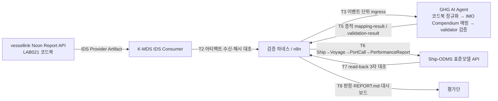

# K-MDS 실증 S-1-1 TTA 공인시험 평가보고서 (초안 v0.1)

| 항목 | 내용 |
|---|---|
| 과제 | (RS-2024-00454634) 스마트·자율운항선박-밸류체인 간 데이터 표준개발 및 서비스 설계 — 3차년도 실증 |
| 시험 시나리오 | S-1-1 GHG 환경규제 의무보고 데이터 상호운용성 (vessellink → K-MDS IDS → GHG AI Agent → Ship-ODMS 표준모델 API) |
| 평가 방식 | TTA 공인시험 (성능목표 #9 [확인 필요: 사업계획서 목표 원문 삽입]), ISO/IEC 25023 기반 데이터 정합성 항목 우선 |
| 문서 상태 | **초안 v0.1 — 연구책임자 검토·승인 대기** (승인 후 Word·PPT 변환) |
| 작성일 | 2026-09-26 |
| 근거 문서 | `verification/scenarios/K-MDS_실증_시나리오_v0.2_S-1-1.md`, `verification/progress.md`(S09·S10), `verification/verification_cases.json`(C02), `pm/decisions.md`(2026-09-26) |
| 증적 위치 | `verification/evidence/C02/s11/run_NN/` (공개 저장소), 참여기관 인프라 주소 포함 증적은 `verification/evidence-private/` (로컬 보관) |

`[확인 필요]` 표기는 연구책임자 또는 TTA 확인 후 확정할 항목이다. 표준 조항 인용은 배치된 원본(`data/raw/`)에서 읽은 것만 적었고, 원본이 없는 표준은 "표준 근거 미확인"으로 남겼다.

---

## 1. 시험 개요

### 1.1 목적
선박 운항 플랫폼(랩오투원 vessellink)이 IDS Provider 로 제공한 GHG 의무보고용 정오보고(Noon Report) 데이터를, K-MDS IDS Consumer 로 수신하고, GHG AI Agent(IMO Compendium 매핑 스킬 내장)가 국제표준(IMO Compendium FAL50) 데이터 요소로 매핑·검증한 뒤, GHG 표준모델 API(Ship-ODMS, KR GEARs 대역)에 입력했을 때 **데이터가 손실·왜곡 없이 상호운용되는지**를 정량 판정한다.

### 1.2 범위 (2026-09-26 확정, `pm/decisions.md`)
- 포함: S-1-1 한 경로(Provider → Consumer → Agent → Ship-ODMS)와 데이터 정합성 항목(ISO/IEC 25023 기반).
- 제외: S-2(RIMS 포트콜), S-3(KLNET MSW), 유엔젤 BLUEONE 경유 등록, KR GEARs 실계약 전송(Token·endpoint 미확보, F-21), DAQ Logger(ISO 19848) 데이터 검증(D5 미결).
- 시험 장소·입회: RIMS 진해 특수선 센터(시뮬레이터 인프라), TTA 입회 예정. 본 초안의 결과는 **한국선급 로컬 환경(노트북 docker)** 실행분이다.

### 1.3 평가 대상 시스템 (SUT)
| 구성요소 | 역할 | 구현/버전 | 위치 |
|---|---|---|---|
| vessellink (랩오투원, LAB021) | IDS Provider 데이터 원천. Noon Report API(코드북 156 항목), DAQ Logger API(ISO 19848 코드북 1,368 항목) | 외부 | 참여기관 |
| K-MDS IDS Provider/Consumer (유엔젤) | Dataspace Connector 8.0.2 기반 데이터 공간. Consumer 가 Artifact 수신 | 외부 | 참여기관 |
| **GHG AI Agent** (한국선급) | ingress → profile → map(IMO Compendium) → validate → transform 파이프라인. 결정적 매핑 우선, LLM(Gemini)은 미해결 필드 후보 제안, 스킬(validator)이 FAL50 registry 로 검증 | `apps/kr-ghg-ai-agent`, docker `kmds-ghg-agent`(:8001) | 로컬 |
| imo-compendium-mapping-validator | FAL50 registry(1,205 요소) 기반 매핑 검증 스킬 | `apps/imo-compendium-mapping-validator` | 로컬 |
| **Ship-ODMS / K-MDS GHG Verifier 포털** | GHG 표준모델 API(Java Spring, SQLite) + Blazor 포털(챗봇·선박 목록·대시보드) | `apps/data-space`, docker `kmds-ghg-verifier-backend`(:8088)·`-frontend`(:3031) | 로컬 |
| 검증 하네스 | 시험 단계(T0·T2·T5~T8) HTTP 도구, 판정·보고서·대시보드 | `verification/automation/harness.py`, docker `kmds-s11-harness`(:8090) | 로컬 |
| n8n | 실증 자동화 오케스트레이터(웹훅 워크플로) 및 AI Agent 대화형 워크플로 | docker `n8n`(:5678), 인스턴스 2.23.2 | 로컬 |

### 1.4 데이터 흐름


---

## 2. 표준 근거

| 표준 | 사용 목적 | 원본 배치 | sha256(앞 16) |
|---|---|---|---|
| IMO Compendium FAL50 (IMO Data Set / Code list) | 표준 데이터 요소 ID(IMO0xxx), 이벤트·연료 코드 | `data/raw/FAL50/IMO Compendium.xlsx` | 5d2ed626057062ab |
| ISO/IEC **DIS** 25023:2014(E) | 측정 ID·측정함수(M1~M5) | `data/raw/ISO25000/ISO_IEC_DIS_25023(E)-Character_PDF_document.pdf` | 38a6ac16f6f33eb6 |
| MEPC.308(73) Annex 5 (2018 EEDI 계산 지침) 표 p.5 | 부가 서비스(연간 GHG 집계)의 CF·LCV | `data/raw/MEPC/MEPC.308(73).pdf` | (data/raw/MEPC/source-manifest.yaml) |
| 랩오투원 Noon 코드북(externalKey → IMO ID) | Provider 항목의 IMO 코드화 근거(D4) | `apps/kr-ghg-ai-agent/var/reference/lab021/noon-code-book.json` | 993da0c15b138952 |
| 후보집합 0.2.0-provisional (159 요소) | 에이전트 허용 표준항목(D2) | `apps/kr-ghg-ai-agent/var/candidate-inventory.json` | 0d48eec2e235365b |
| GHG 표준모델 API 사양 | 대상 필드(IMO ID ↔ 필드) 대응 | `shared/standard-model/openapi.yaml` | — |

`[확인 필요] W7`: 배치된 25023 은 DIS(2014) 초안본이다. TTA 가 IS 2016 판을 적용하면 측정 ID·문구를 재대조한다. 데이터 품질 자체는 표준이 ISO/IEC 25024(Con-I-1)를 가리키므로 25024 적용 여부는 별도 결정.

---

## 3. 시험 항목 및 판정 기준

### 3.1 측정 항목 (ISO/IEC DIS 25023 기반, 시나리오 v0.2 §3)
| 항목 | 25023 측정 | 측정함수 | 이 시험의 A·B | 목표 |
|---|---|---|---|---|
| M1 전달 정확성 | CIn-2-G Data exchange protocol conformance (취지 적용) | X = A/B | A = 원본과 sha256 동일한 수신 Artifact, B = 수신 Artifact | 1.0 |
| M2 표준 매핑 완결성 | FCp-1-G Functional coverage | X = 1 − A/B | A = 미매핑 필드, B = 원본 입력 필드 | ≥ 0.95 |
| M3 표준 검증 정확성 | FCr-1-G Functional correctness | X = 1 − A/B | A = validator FAIL 필드, B = 확정 매핑 필드 | 1.0 |
| **M4 값 정합성 (채택 정합율)** | FCr-1-G 를 "필드 전달" 단위에 적용 | X = 1 − A/B | A = 원본↔저장값 불일치 필드, B = 표준모델 대응 필드가 있는 원본 필드 | **≥ 0.95** |
| M5 필수 요소 충족 | CIn-1-G Data exchange format conformance (취지 적용) | X = A/B | 스키마 required 충족 / required | N/A (사양에 required 없음) |

값 비교 규칙(T7): 숫자 상대오차 ≤ 0.1 % 또는 절대차 ≤ 1e-6, 문자열 정확 일치(형 정규화 허용), 시각 UTC 초 단위 일치, 결측(−9999, "") = null.

### 3.2 판정 규칙 (`run_s11.py judge`, 하네스 T8 동일)
| 규칙 | 조건 |
|---|---|
| R-M4 | M4 ≥ 0.95 |
| R-M3 | M3 = 1.0 |
| R-M2 | M2 ≥ 0.95 |
| R-T6 | Ship-ODMS HTTP 오류 0 |
| R-T5 | 에이전트 증적 무결성(sha256 manifest) ok |
| R-T2 | IDS 전달 PASS 또는 NOT_TESTED(자격증명 없음/보관본 사용) |
| R-T8 | 직전 run 과 M2·M3·M4 동일(재현성) |

종합 판정: 전부 충족 → PASS, R-M4 미충족 → FAIL, 그 외 미충족 → PARTIAL. T2 가 NOT_TESTED 인 PASS 는 "PASS (T2 NOT_TESTED)" 로 표기하고 외부 IDS 단계 증적(9/12·9/16 수동 실측 2/2 동일)으로 보완한다.

---

## 4. 시험 절차 (T0~T8)

| 단계 | 내용 | 수행 주체 | 증적 파일 |
|---|---|---|---|
| T0 | 기준선: 코드 commit, FAL50·코드북·후보집합 해시, 원본 payload 해시, Ship-ODMS 도달성, LLM 구성 | 하네스 | `T0-baseline.json` |
| T1 | (사전) Provider 데이터 등록 확인 — 랩오투원 | 참여기관 | `manual_S03/`, `manual_S05/`(private) |
| T2 | K-MDS Consumer 에서 Noon Artifact 수신 → 원본 sha256 대조 | 하네스(자격증명 env) | `T2-ids-transfer.json`, `T2-received-artifact.json` |
| T3 | 이벤트(시각순) 단위로 에이전트 ingress 투입 (G-3: Artifact 1건 = 이벤트 배열) | n8n 워크플로 / AI Agent 도구 | `events.json` |
| T4 | 에이전트 파이프라인: 코드북 정규화 → 매핑 → validator 검증 → 변환 | GHG AI Agent | `agent-evidence/<cid>/*` |
| T5 | 증적 수집·무결성 확인 | 하네스 | `T3-T5-agent.json` |
| T6 | Ship-ODMS 전송 (Ship→Voyage→PortCall→PerformanceReport, 연료 하위행) | 하네스(`adapters/imo_to_shipodms.py`) | `shipodms/shipodms-plan.json`, `shipodms-delivery.json`, `shipodms-http-log.json`, `T6-shipodms.txt` |
| T7 | read-back 3자 대조·측정치 산출 | 하네스(`adapters/consistency_check.py`) | `shipodms/consistency-report.json`, `T7-consistency.txt` |
| T8 | 판정·보고서 | 하네스 | `result.json`, `REPORT.md`, 대시보드 |

실행 방식 3가지(모두 같은 증적 형식 `run_NN`):
1. **러너 CLI**: `uv run --project apps/kr-ghg-ai-agent --with pyyaml python verification/run_s11.py --run` (run_01·02).
2. **n8n 웹훅 워크플로** "K-MDS S-1-1 실증 자동화"(ID Pycuq2NaVtsIv3xJ): `POST http://localhost:5678/webhook/kmds-s11` (run_03~06). 노드별 입·출력이 n8n Executions 에 남는다.
3. **AI Agent 대화형 워크플로** "K-MDS GHG 데이터 AI Agent"(ID toAlr11gvHNYHvvy): 챗봇이 도구(fetch → map → deliver → consistency → judge)를 대화로 호출 (run_08).

---

## 5. 시험 결과 (2026-09-26, 한국선급 로컬)

### 5.1 run 요약
| run | 실행 방식 | LLM | T2 | M2 | M3 | M4 | 판정 | 비고 |
|---|---|---|---|---|---|---|---|---|
| run_01 | 러너 CLI | mock | NOT_TESTED | 0.9945 | 1.0 | 0.9854 | PASS (T2 NOT_TESTED) | 기준 실행 |
| run_02 | 러너 CLI | mock | NOT_TESTED | 0.9945 | 1.0 | 0.9854 | PASS (T2 NOT_TESTED) | 재현성 run_01 동일 |
| run_03 | n8n 웹훅 | gemini-2.5-flash | DIFFERENT | 0.9945 | 1.0 | 0.9854 | PARTIAL | T2 만 미충족 |
| run_04 | n8n 웹훅 | gemini-2.5-flash | DIFFERENT | 0.9394 | 1.0 | 0.9872 | PARTIAL (**오염**) | 시험 환경 운용 오류, §5.4 |
| run_05 | n8n 웹훅 | gemini-2.5-flash | DIFFERENT | 0.9945 | 1.0 | 0.9854 | PARTIAL | T2·T8(직전 run_04 오염) 미충족 |
| run_06 | n8n 웹훅 | gemini-2.5-flash | DIFFERENT | 0.9945 | 1.0 | 0.9854 | PARTIAL | **T2 만 미충족**, 재현성 run_05 동일 |
| run_08 | AI Agent 대화 | gemini-3.6-flash | NOT_TESTED(보관본) | 0.9945 | 1.0 | 0.9854 | PASS (T2 NOT_TESTED) | 대화형 자동화 |

(run_07·09·10 은 LLM 한도 또는 대화 중단으로 fetch 단계까지만 남은 증적. 삭제하지 않고 보존.)

### 5.2 측정치 상세 (run_06 = run_08, 이벤트 12건)
- M2 = 1 − 4/726 = **0.9945**. 미매핑 4 = `isEuPort`(코드북이 IMO0856/0857 두 관할코드에 걸리고 값이 boolean — 규칙 미확정).
- M3 = 1 − 0/722 = **1.0**. 검증 PASS 734 / WARNING 195(PROFILE_NOT_APPLICABLE: 선박 일반정보 요소가 Noon 데이터셋 밖) / FAIL 0.
- M4 = 1 − 5/342 = **0.9854**. 불일치 5건 전부 `IMO0632 → WeatherDetails.seaHeight` (원본 0.5·0.8 → 저장 0; Ship-ODMS 정수형, G-5).
- 표준모델에 대응 필드가 없어 전송·분모에서 제외한 IMO 요소 16종: IMO0064·0084·0085·0543(다음항 ETA·코드·명·계획시각), 0066·0541(ETD·ETB), 0109·0112(항구명), 0139·0143·0148(GT·NT·등록항), 0452(밸러스트), 0548(선석), 0580(선장), 0666·0667(벙커항).
- Ship-ODMS 생성: Ship 1, Voyage 1, PortCall 2, PerformanceReport 12, 연료 하위행(연료코드별 + `_NONFUEL`), HTTP 오류 0.
- LLM(Gemini) 실호출 4회/run — isEuPort 후보 제안(2건), validator 검증 미통과로 UNMAPPED 유지(허위 매핑 차단 설계 확인). 측정치는 mock LLM(run_01·02)과 동일 → 결정적 매핑이 결과를 지배.

### 5.3 T2(IDS 전달) 현황
- 9/12·9/16 수동 실측: Consumer 수신본 = vessellink 원본(sha256 fb23ffbd…, 14,101 B) 2/2 동일 (증적 `manual_S03`, `manual_S05`, 인프라 주소 포함분은 private).
- 2026-09-26 자동 실행(run_03~06): Consumer 수신 200, 274 B, `events: []` → Provider 가 이벤트 0건 상태(**F-22**, 9/16 이후 지속). 원본과 다르므로 DIFFERENT → PARTIAL. 랩오투원 데이터 복원 후 같은 웹훅으로 재실행하면 T2 PASS 포함 종합 PASS 판정이 가능하다.

### 5.4 오류·조치 기록 (숨기지 않음)
| 항목 | 내용 | 조치 |
|---|---|---|
| run_04 오염 | 실행 중 호스트에서 에이전트 테스트를 병행해 `var/registry.sqlite3` 잠금 경합 → SKILL_EXECUTION_ERROR 10건 → fail-closed 로 unmapped 증가(M2 0.9394) | 결과 미수정, `run_04/NOTE-interference.md` 기록, 운용 규칙(실행 중 호스트 작업 금지) README 추가, run_05·06 재실행 |
| 에이전트 결함 | 파이프라인 팩토리가 LLM 클라이언트 팩토리를 호출하지 않아 설정과 무관하게 mock 사용 | 수정(커밋 b724492), `/ready` 가 provider·real 여부 보고 |
| Ship-ODMS 결함(G-4·G-6) | 자식 행 부모참조 누락, 목록 DTO 필드 누락, 프론트엔드 형 불일치(yearReportId int, 풍향·기온 int), 미구현 라우트 3종, 포트 3030 충돌 | 수정(커밋 4ee4e38·0531d8a·e0d20f8·47d23ce·4363c2d) |
| LLM 한도 | Gemini 무료 티어 모델별 일 20회(429) — 파이프라인 4회/run, 대화 에이전트 턴당 6~7회 | 모델 전환으로 우회(3.6-flash → 3.1-flash-lite). **실증 당일 유료 키 또는 Open 모델 필요** |
| 반복 전송 누적 | 같은 12 이벤트를 8회 전송해 Ship-ODMS 에 보고 96건 누적 | 연간 집계는 동일 (voyage, 시각, 이벤트) 중복 제외. DELETE /api/ships 추가(66a9be9). 초기화는 사용자 결정 |

---

## 6. 증적 패키지

### 6.1 구성 (run 당)
```
verification/evidence/C02/s11/run_NN/
  run-meta.json            실행 메타(오케스트레이터, LLM, 원본 sha256, n8n 실행 ID)
  T0-baseline.json         기준선(commit, 표준 원본 해시, 후보집합, 코드북)
  T2-ids-transfer.json     IDS 수신 결과(해시 대조), T2-received-artifact.json
  events.json              이벤트 단위 투입 레코드(correlation_id 포함)
  T3-T5-agent.json         이벤트별 상태·필드·미매핑·LLM 호출·검증 집계·무결성
  agent-evidence/<cid>/    에이전트 증적: raw-input, pre-normalization(코드북), normalized-input,
                           profile/mapping/validation-result, llm-calls, skill-calls, kr-gears-output,
                           manifest.json(sha256), summary.md
  shipodms/                plan / delivery / http-log / consistency-report(측정치·342 대조·불일치 목록)
  T6-shipodms.txt, T7-consistency.txt   실행 로그(exit code)
  result.json              판정(규칙·측정치·재현성), REPORT.md(평가단 보고서)
```
- 무결성: 각 에이전트 증적은 `manifest.json` 의 sha256 으로 검증(R-T5). `REPORT.md` 말미에 주요 파일 sha256 을 적는다.
- 열람: `http://localhost:8090/runs/run_NN/report`(보고서), `http://localhost:8090/dashboard?run=run_NN`(대시보드), n8n Executions(노드별 입·출력), 포털 `http://localhost:3031`.
- 공개/비공개: 참여기관 인프라 주소(K-MDS IDS 호스트·포트, KR Nexawave 호스트, vessellink 테스트 URL)가 든 증적 81건은 `verification/evidence-private/`(git 제외)에 보관하고 문서에는 `<K-MDS-IDS-HOST>`, `<KR-NEXAWAVE-HOST>` 로 마스킹한다. 자격증명 값은 어디에도 기록하지 않는다.

### 6.2 주요 증적 해시 (앞 16자리)
| 파일 | sha256 |
|---|---|
| run_01/result.json | feeab283ff3fe15b |
| run_02/result.json | 7fd837de42a49aad |
| run_06/result.json | 722449661f8eb5e9 |
| run_08/result.json | d439b9e4b14cd11d |
| 원본 payload Noon_Report_API__e5e3be7e7a31.json | fb23ffbdcb00e11d |

`[확인 필요] W7`: TTA 가 요구하는 증적 패키지 형식(파일 명명, 서명, 제출 매체)에 맞춰 재구성한다.

---

## 7. 알려진 제한 및 미결 사항

| ID | 내용 | 영향 | 담당·계획 |
|---|---|---|---|
| F-22 | Provider(vessellink) Noon 이벤트 0건(9/16 이후) | T2 DIFFERENT → 종합 PARTIAL | 랩오투원 복원(10-14 진도점검 후 보강), 재실행 |
| F-23 | Provider Broker 미등록(Unregistered), Broker 검색 500 | 검색 경로 미검증(계약·전송은 정상) | 유엔젤/RIMS |
| W5 | Consumer Route → 에이전트 실전송(진해 현장, 노트북 로컬 IP) 미검증 | T3 를 러너/n8n 이 대신 투입(G-3) | 진해 현장 |
| W7 | 25023 적용 판(DIS 2014 vs IS 2016), 증적 형식 | 측정 ID 재대조 가능성 | TTA 합의 |
| G-1 | Ship-ODMS `fuelType` int32 vs FAL50 연료코드 문자열 | `fuelTypeTradeName` 에 코드 저장(WORKAROUND) | 스키마 결정 |
| G-5 | `seaHeight` 정수형 | M4 불일치 5건의 유일 원인 | 스키마 결정 |
| isEuPort | 코드북 boolean vs IMO0856/0857 관할코드 | M2 미매핑 4건의 유일 원인 | 매핑 규칙 결정 |
| F-16 | DCS/MRV 필수 항목 일부 미도출(GEARs Type1 기준) | GEARs 실전송 시 필수 52 중 50 | 랩오투원 보강 |
| F-21 | KR GEARs Nexawave Token·endpoint 미확보 | KR GEARs 실전송 제외 | KR |
| LLM | Gemini 무료 티어 한도 | 자동화 실행 중단 가능 | 유료 키/Open 모델 |
| CII | Ship-ODMS 표준모델에 CII·선박 용량(DWT) 필드 없음 | 부가 서비스가 GFI(TtW)만 입력, CII 미산출 | 표준모델 확장 결정 |
| D3·D5 | 코드북 1:N 해소 요청, DAQ(ISO 19848) 검증 규칙 | 범위 외 | 보류 |

---

## 8. 사용 매뉴얼 (시험 입회·재현용)

### 8.1 사전 조건
- Windows 11 + Docker Desktop, n8n 컨테이너(:5678, Gemini 자격증명 등록), `C:\kr-dev\.env.master`(GEMINI_API_KEY, IDS_CONNECTOR_* — 값은 기록·공유 금지).
- 저장소 `C:\kr-dev\k-mds` (커밋 838bdc6 이상). 표준 원본 `data/raw/FAL50`, `data/raw/ISO25000`, `data/raw/MEPC` 배치.
- 에이전트 준비물: `apps/kr-ghg-ai-agent/var/{registry.sqlite3, candidate-inventory.json, reference/lab021/noon-code-book.json}` (없으면 `uv run python tools/prepare_registry.py`, `tools/build_candidate_inventory.py`).
- 포트: 8088(표준모델 API), 3031(포털), 8001(에이전트), 8090(하네스), 5678(n8n). 3030 은 다른 서비스(langfuse)가 점유.

### 8.2 기동 순서
```powershell
cd C:\kr-dev\k-mds
# 1) K-MDS GHG Verifier (표준모델 API + 포털)
docker compose -f apps/data-space/compose.yaml up -d --build
# 2) GHG AI Agent + 검증 하네스 (LLM 모델은 필요 시 LLM_MODEL 로 오버라이드)
docker compose --env-file C:/kr-dev/.env.master -f verification/automation/compose.yaml up -d --build
# 3) 준비 상태 확인
curl http://localhost:8088/api/ships          # 200
curl http://localhost:8001/ready              # status READY, llm.provider gemini, real true
curl http://localhost:8090/health             # status ok
```
n8n 에서 워크플로 두 개가 **활성(Active)** 인지 확인한다: "K-MDS S-1-1 실증 자동화", "K-MDS GHG 데이터 AI Agent". n8n 편집 후에는 모델 노드(Gemini)가 의도한 모델인지 확인하고 재활성화(publish)한다.

### 8.3 시험 실행 A — 웹훅 자동화 (권장, 입회 시연)
```powershell
curl -X POST http://localhost:5678/webhook/kmds-s11 -H "content-type: application/json" -d "{\"skip_ids\": false}"
```
- 약 3~4분 소요. 응답 JSON 에 `verdict`, `measures`, `report_url`, `evidence_dir`.
- `skip_ids: true` 면 T2 를 NOT_TESTED 로 두고 2026-09-12 보관본으로 진행한다(Provider 데이터 없을 때).
- 진행 상황: n8n → Executions → 최신 실행 → 노드별 입·출력. 결과: `http://localhost:8090/runs/run_NN/report`.

### 8.4 시험 실행 B — 챗봇(AI Agent) 대화
포털 `http://localhost:3031/chat`(또는 `http://localhost:5678/webhook/kmds-ghg-agent-chat/chat`)에서 입력 예:
1. "IDS Consumer 를 통해 랩오투원 정오보고 데이터를 가져와 IMO Compendium 으로 매핑하고 Ship-ODMS 에 입력해줘. 정합성 판정까지 보고해줘." → Provider 이벤트 0건이면 보관본 사용 여부를 묻는다 → "네, 보관본으로 진행" .
2. "IMO 00000009 선박의 CII 값을 조회하고 없다면 연차보고(연간 GHG 집계)를 계산해서 Ship-ODMS 에 입력해줘." → CII 필드 없음 안내, DWT 질의, 연간 집계(CF·LCV MEPC.308(73)) 후 `YearPerformanceReport.totalGfiAnnually` 입력.
3. "매핑 결과 대시보드 보여줘." → 총 항목/변환 성공·실패/전달 성공·불일치/코드북 변환·미해결 수치 표 + 대시보드 URL.
에이전트 규칙: 수치는 도구 응답만 보고, 입력(전송)은 사용자가 요청할 때만, 가정(assumptions)은 그대로 전달.

### 8.5 시험 실행 C — 러너 CLI (n8n 없이 재현)
```powershell
uv run --project apps/kr-ghg-ai-agent --with pyyaml python verification/run_s11.py --dry-run
uv run --project apps/kr-ghg-ai-agent --with pyyaml python verification/run_s11.py --run --skip-ids
```
(러너는 에이전트를 프로세스 내에서 실행하므로 컨테이너 에이전트와 독립. LLM 은 로컬 `.env` 설정을 따른다.)

### 8.6 결과 확인
| 화면 | 주소 | 내용 |
|---|---|---|
| 판정 보고서 | `http://localhost:8090/runs/run_NN/report` | 측정치·규칙·이벤트별 결과·불일치·증적 sha256 |
| 매핑 증적 대시보드 | `http://localhost:8090/dashboard?run=run_NN` (포털 메뉴 "대시보드") | 총 항목, IMO code 변환 성공/실패, 전달 성공/불일치, 대상 없음, 코드북 변환/미해결, 이벤트별 표 |
| 표준모델 데이터 | `http://localhost:3031/ships/4/voyages/2/performance-reports` (포털 "선박 목록") | 저장된 Ship/Voyage/PortCall/PerformanceReport, 연료·FOC·기상 하위 페이지 |
| n8n 실행 로그 | `http://localhost:5678` → Executions | 노드별 입·출력, 오류 원문 |
| 증적 파일 | `verification/evidence/C02/s11/run_NN/` | §6.1 |

### 8.7 운용 규칙·문제 해결
- 실행 중 호스트에서 에이전트 테스트·스크립트(`uv run pytest` 등)를 돌리지 않는다(registry SQLite 잠금 → run_04 오염 사례).
- 증적 디렉터리는 덮어쓰지 않는다(run 번호 증가). 실패한 run 도 보존한다.
- `429 Too Many Requests`(Gemini): 모델 전환 — 컨테이너 `LLM_MODEL=<model> docker compose ... up -d ghg-agent`, n8n 은 Gemini 노드 modelName 변경 후 재활성화. 유료 키가 있으면 `.env.master` 의 GEMINI_API_KEY 교체.
- `503 high demand`: 재시도(에이전트 노드 재시도 3회/45초 설정) 또는 모델 전환.
- 포털 페이지 배너 "백엔드 API 서버에 연결할 수 없습니다": `docker ps` 로 `kmds-ghg-verifier-backend` 확인, 프론트엔드 `ApiSettings__BaseUrl` 확인.
- T2 DIFFERENT: Provider 스냅샷이 원본과 다름(F-22). 시험은 보관본으로 계속하되 판정은 PARTIAL 로 남는다.
- 데이터 초기화: `DELETE /api/ships/{id}`(항차·포트콜·보고·연차보고 연쇄 삭제). 실행 전 `apps/data-space/java/ship_odms/ship_odms.db` 백업.

---

## 9. 결론 (초안)
- 로컬 환경에서 S-1-1 경로의 데이터 정합성 항목은 목표를 충족한다: **M2 0.9945, M3 1.0, M4 0.9854(≥ 0.95)**, HTTP 오류 0, 증적 무결성 ok, 재현성(run_01↔02, run_05↔06) 확인. 러너·n8n 웹훅·AI Agent 대화 세 방식이 같은 측정치를 낸다.
- 종합 PASS 를 위해 남은 것은 외부 조건 하나(F-22: Provider 이벤트 복원 → T2 PASS)와 현장 검증(W5: Consumer Route 실전송)이다.
- 남은 결정: W7(25023 판·증적 형식), G-1/G-5 스키마 형, isEuPort 규칙, LLM 키.

---

## 부록 A. 결정 이력 (`pm/decisions.md`, 2026-09-26)
S-1 우선·S-1-1 정의 / TTA 시험만 우선, ISO 25023 정합성 항목 / 정합율 = M4 채택 / S-2·S-3·BLUEONE 제외 / 랩오투원 보강은 10-14 이후 / 실증 장소 RIMS 진해, TTA 입회 / D2·D4·D8 승인(후보집합 확장, 코드북 규칙 에이전트 내장) / Route 는 노트북 로컬 IP.

## 부록 B. 코드 변경 이력 (주요 커밋)
4ee4e38 시나리오 v0.1/v0.2, 코드북 ingress, 전송·정합성 확인기, run_01·02 / b724492 n8n 자동화 스택, run_03~06 / 7be2227 AI Agent 대화형, run_08 / 4363c2d·0531d8a·e0d20f8·47d23ce 포털 결함 수정 / 391175c 부가 서비스(연간 GHG 집계·대시보드) / 66a9be9 DELETE API / aeddee3·838bdc6 K-MDS GHG Verifier 포털 이름·메뉴.

## 부록 C. 용어
IDS(International Data Spaces) Provider/Consumer·Artifact·Route / IMO Compendium FAL50 데이터 요소 ID(IMO0xxx) / 코드북(랩오투원 externalKey → IMO ID) / 후보집합(에이전트가 확정할 수 있는 표준항목 목록) / validator(FAL50 registry 검증 스킬) / Ship-ODMS(GHG 표준모델 API, KR GEARs 대역) / M2·M3·M4(ISO/IEC 25023 측정) / run_NN(증적 단위).
