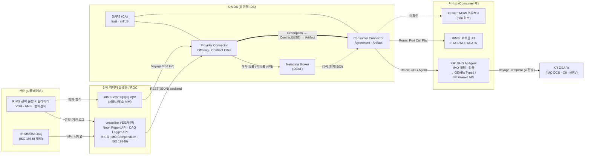
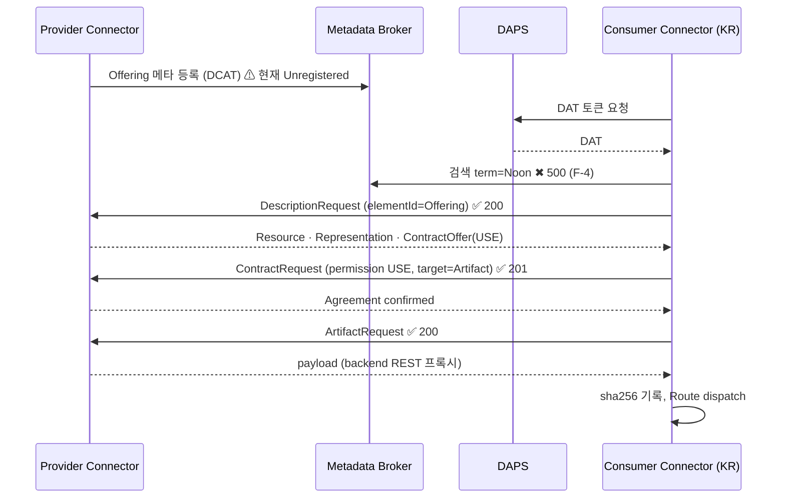
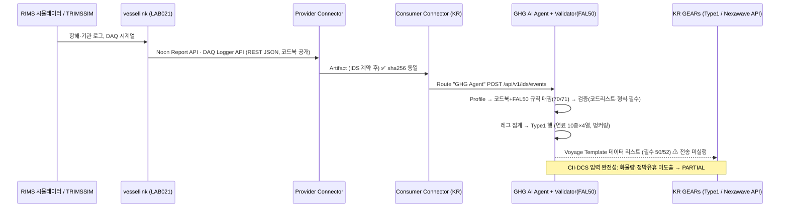
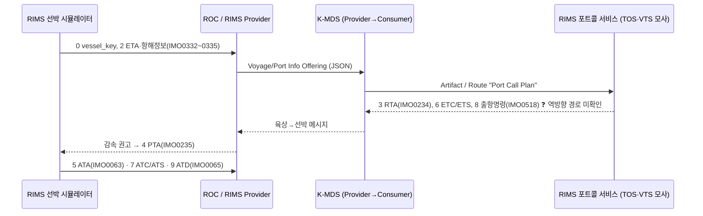
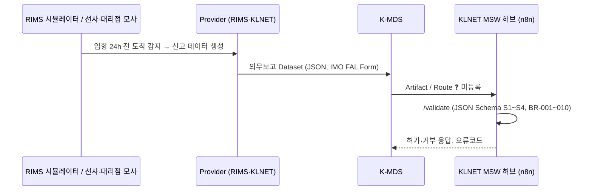

# K-MDS 3차년도 실증 시나리오 정리 (v0.1, 검토용)

- 과제: (RS-2024-00454634) 스마트·자율운항선박-밸류체인 간 데이터 표준개발 및 서비스 설계, 3차년도(2026-04-01 ~ 2027-03-31)
- 작성: 2026-09-26, K-MDS Orchestrator. 상태: **초안(연구책임자 검토 대기)**
- 목적: 지금까지 문서·회의·실증 세션(S01~S05)에서 확인한 실증 시나리오를 한 곳에 정리하고, 수요기업 평가·공인기관 시험(TTA)용 검증 가능 시나리오로 다듬기 위한 출발점을 만든다.
- 표기 규칙: ✅ 문서·실행으로 확인된 사실 / ⚠ 문서에 있으나 미확정·미실행 / ❓ 문서 근거 없음(추정 또는 결정 필요). 인프라 주소는 `<K-MDS-IDS-HOST>`, `<KR-NEXAWAVE-HOST>`로 마스킹.

---

## 1. 실증의 목적과 평가 체계

| 구분 | 내용 | 근거 |
|---|---|---|
| 3차년도 목표 | 데이터 표준 기반 상호운용성 **기술 검증**: 공유기술·보안 검증 / ISO 기고 / 품질관리 지침 / 서비스 수요기업 평가 / 시뮬레이터 기반 데이터 상호운영성 검증 | 수정사업계획서 p.3, p.57 ✅ |
| 성능목표 #4 | 데이터 공유 개념 설계 **데이터정합율 95 %** (IDSA Guide, 전문가평가) — 산식 미정 ❓ | p.32 |
| 성능목표 #6·7·8 | 환경규제(IMO MEPC) / 포트콜(IALA S-211·ISO 28005) / 의무보고(IMO FAL) 서비스 3종 — **수요기업 평가(제3자 입회)** | p.32, p.34 |
| 성능목표 #9 | 데이터 상호운용 **시뮬레이터 기반 검증 1건** — ISO/IEC 25023 기준, IMO MSC.1/Circ.1512 기반 **전문기관(TTA) 시험보고서** | p.32, p.35, p.221 |
| 유엔젤 통합테스트 판정 | "각 단계 응답 정상 + 데이터 정합율 95 % 이상" | 착수회의 유엔젤 p.11 ✅ |
| 실증 일정(착수 KR p.3) | 6~8월 표준변환 PoC → **9~10월 데이터 연계 실증** → 11~12월 수요평가(w/ TTA). 장소 RIMS 서울사무소 또는 진해 | ⚠ 진행 중 |
| 실증 환경 | **시뮬레이션 기반**(RIMS 선박 시뮬레이터 + 유엔젤 K-MDS IDS). 실선·실항만 적용 근거 없음 | ✅ |

평가 방식이 셋으로 갈리므로 시나리오마다 "누가 무엇을 보고 합격을 판정하는가"를 분리해 적어야 한다.

| 평가 | 판정자 | 보는 것 | 시나리오 요구 |
|---|---|---|---|
| 수요기업 평가(#1·6·7·8) | 수요기업 7사 + 제3자 입회 | 서비스가 업무에 쓸 만한가 | 업무 언어의 유스케이스, 화면·결과물, 평가표 |
| 전문가평가(#3·4·5) | 외부 전문가 | 명세 체계·유용성·명확성 | 설계서·정합율 산식·증적 |
| 전문기관 시험(#9) | TTA | 시나리오대로 데이터 공유·서비스가 재현되는가 | 시험 절차서, 입력 데이터, 판정 기준, 증빙 패키지 형식 |

---

## 2. 시스템 구성 (확인된 것 기준)

| 블록 | 시스템 | 담당 | 상태 |
|---|---|---|---|
| 선박(OnBoard) | RIMS 선박 운항 시뮬레이터(진해; VDR·AMS, 컨테이너선 자산 98종), TRIMSSIM 시뮬레이터 데이터 | RIMS | ✅ 존재, 접근 방법 문서 없음 ❓ |
| 선박 데이터 플랫폼 | **vessellink**(랩오투원 LAB021): Noon Report API(IMO Compendium 키), DAQ Logger API(ISO 19848 키), 코드북 공개 | 랩오투원 | ✅ 실행 확인 |
| ROC(육상 원격운용) 모사 | RIMS 서울사무소 서버 2EA(#1 Provider, #2 Consumer) | RIMS | ⚠ 구축 완료 언급, 미검증 |
| K-MDS(IDS) | DAPS(CA), Metadata Broker, Provider Connector, Consumer Connector (Dataspace Connector 8.0.2, DCAT) | 유엔젤 | ✅ 가동. **Broker 등록 상태 Unregistered, 검색 500**(F-4·F-23) |
| 서비스 Consumer ×3 | 해운: RIMS 포트콜 / 항만: KLNET MSW(n8n 허브) / 선급: KR GHG AI Agent → KR GEARs | RIMS·KLNET·KR | KR ✅ / RIMS ⚠(포트콜 Dataset 등록 확인) / KLNET ❓ |
| KR 검증·전달 | GHG AI Agent(k-mds/apps/kr-ghg-ai-agent) + imo-compendium-mapping-validator(FAL50 registry 1,205) + 어댑터 → KR GEARs Type1 Voyage Template / Nexawave API | KR | ✅ 로컬 실행. GEARs 실제 전송 미실행(Token) |
| 참조 표준 | IMO Compendium FAL50(FAL.5/Circ.56), ISO 19848:2024, IALA S-211, ISO 28005, IMO FAL, MEPC 지침 9건 | — | ✅ 원본 배치 |

### 2.1 전체 데이터 흐름도

실선은 실행으로 확인한 경로, 점선은 문서상 계획 또는 미확인 경로다.

---

## 3. 시나리오 목록

과제 문서(2차 실증회의 Lane 표, KR pptx s.1~2)와 CASE_LIST(C01~C07)를 대응시켰다.

| ID | 시나리오 | Provider → Consumer | 대응 성능목표 | 평가 | 현재 상태 |
|---|---|---|---|---|---|
| S-0 | K-MDS 데이터 공유 절차(등록→게시→검색→계약→전송) | 유엔젤 Provider → Broker/DAPS → Consumer(KR·RIMS·KLNET) | #4 | 전문가·TTA | ✅ 발견·계약·전송 동작 / Broker 검색 실패 |
| S-1 | GHG 환경규제 의무보고(선급 Lane) | vessellink(랩오투원) → K-MDS → KR GHG AI Agent → KR GEARs | #6, #4, #1 | 수요기업(팬오션·포스에스엠 등) + TTA | PARTIAL(매핑 98.6 %, 필수 4항목 미도출) |
| S-2 | 포트콜 JIT 이벤트 교환(해운 Lane) | RIMS 시뮬레이터 → ROC → K-MDS → RIMS 포트콜 서비스(TOS·VTS 모사) | #7 | 수요기업(BPA·UPA·선사) + TTA | ⚠ Dataset 4건 등록 확인, 메시지 스키마 미확보 |
| S-3 | 선박 의무보고 MSW(항만 Lane) | 선사/대리점(RIMS·KLNET) → K-MDS → KLNET MSW | #8 | 수요기업(항만공사) + TTA | ❓ 스키마·허브 미확인 |
| S-4 | 보안·정책 예외(토큰·계약·정책 불일치) | Consumer ↔ DAPS·Broker ↔ Provider | #4, 3차 목표 "보안 검증" | 전문가·TTA | ⚠ 합의서 미완료 |
| S-5 | 시뮬레이터 기반 E2E(3 Lane 통합) | S-0~S-4 전체 | **#9** | **TTA 시험보고서** | ⚠ 시험 항목·증빙 형식 미확정 |

---

## 4. 시나리오 상세

### S-0. K-MDS 데이터 공유 절차 (공통 기반)

- 근거: 유엔젤 외부접속 가이드 §4~6(성공 기준 8항), 1차 회의록 세션4(Dataset/Distribution/DataService/Usage Policy 4개 메타 조회 가능), 착수 유엔젤 p.11(IDS RAM 절차).
- 절차: Self-Description → Catalog(DCAT) 등록 → Broker Discovery → Contract Negotiation → DAPS 토큰 → mTLS → Data Transfer → 로깅.
- 확인된 결과(9/12, 9/16): Description 요청 200, Contract 협상 201(Agreement confirmed), Artifact 수신 200, 수신본 = 원본(sha256). Broker 검색 500·SPARQL 417, Provider의 Broker 등록 상태 Unregistered(F-23).
- 검증 포인트(초안): ① Broker 검색으로 Dataset 유일 식별 ② 계약 체결 후에만 전송 ③ 수신 payload = Provider 원본 ④ 각 단계 로그 존재.
- 미결: Broker 등록 복구(유엔젤·RIMS), DAPS·mTLS 직접 로그 확보(F-7), 정합율 산식.

### S-1. GHG 환경규제 의무보고 (선급 Lane) — 가장 진행된 시나리오

- 근거: KR pptx s.2 BLOCK A/B, 2차 회의록 Lane #3, 수정사업계획서 p.58(시뮬레이션 기반 환경규제 보고 데이터 표준 모델/스키마 검증), kr-ghg-ai-agent UserManual Step 0~13.
- 데이터: vessellink Noon Report(정오·동정보고, IMO Compendium externalKey 71종) + DAQ Logger(ISO 19848 72채널). 선박 IMO 00000009 TEST_BULK_DIESEL_09(시뮬레이터), 2026-04-19~30, 12 이벤트.
- 확인된 결과: Step 0~4 PASS/조건부, 표준 매핑 70/71, GEARs Type1 레그 1 변환(PACTB→GTPRQ, 124.4 h, 871.6 nm, HFO 54.96 MT), Nexawave Voyage Template API 132필드 중 필수 50/52. 판정 PARTIAL.
- 갭: 출항 화물작업 여부·정박 유휴시간·화물량이 Provider 데이터에 없음(F-16), 정박 소비 미보고(F-17), 이벤트 코드 비표준(F-12), 코드북 1:N(F-11), 9/16 이후 Noon 이벤트 0건(F-22), GEARs Token·endpoint 미확보(F-21).
- 결정 대기: D1~D8(verification_cases.json).

### S-2. 포트콜 JIT 이벤트 교환 (해운 Lane)

- 근거: RIMS 2차 실증회의 발표 p.6(이벤트 10종·IMO ID), p.8(모델 1~5), p.23(KPI 예시); 2차 회의록 Lane #1(Provider 유엔젤, Consumer RIMS).
- 이벤트 시퀀스: 0 vessel_key(IMO0136/0140/0234) → 1 출항명령(IMO0236) → 2 ETA·항해정보(IMO0332~0335) → 3 RTA(IMO0234) → 4 PTA(IMO0235) → 5 ATA(IMO0063) → 6 ETC/ETS(IMO0301/0297) → 7 ATC/ATS(IMO0304/0300) → 8 출항명령(IMO0518) → 9 ATD(IMO0065).
- K-MDS 등록 확인(9/16): Provider Offering "Voyage and Port Info - Busan (RIMS) 20260911"(VoyagePortInfo-MSCBARBARA…json 10,509 B), "VoyagePortInfo — RIMS-JIT", "Voyage Port Info API - Busan (RIMS) 20260915"; Consumer Route "Port Call Plan API - Busan (RIMS) 20260915". 부산신항 입항 컨테이너선 3항차.
- 갭: 메시지 JSON 스키마·인터페이스 기준서 미확보, RIMS 시뮬레이터 접근 방법 없음, 서비스 KPI(정시도착률 ≥80 % 등)는 "예시" 표기라 상호운용 검증 규칙과 분리 필요.
- 검증 포인트(초안): 10개 이벤트 방향별 1회 이상 전송, IMO ID 존재·형식, 타임스탬프 단조 증가, 송수신 로그 건수·해시 일치.

### S-3. 선박 의무보고 MSW (항만 Lane)

- 근거: 수정사업계획서 p.62-63(의무보고 10종, 검증 규칙 설정, 메시지 교환 패턴), KLNET 착수 p.46-49(n8n 실증 허브, 공통 모델 Header/Vessel/Voyage, JSON Schema S1~S4, OpenAPI /validate·/submit·/status), 2차 회의록 Lane #2(Provider RIMS/KLNET, Consumer KLNET, 이벤트별 전송).
- 대상 후보: 입출항신고(General Declaration, 랩오투원 코드북 55항목)부터.
- 갭: K-MDS에 KLNET Offering/Route 미확인(9/16 목록에 없음), JSON Schema·검증 규칙 파일 미확보, 1차 대상 신고 미확정.
- 검증 포인트(초안): 신고 메시지 JSON Schema PASS(필수필드 충족률), IMO Compendium ID 일치, 필수필드 누락 시 거부·오류코드 로그, 입·출항 시점 이벤트 전송.

### S-4. 보안·정책 예외 처리

- 근거: 착수 유엔젤 p.11-12(DAPS 토큰·mTLS), KR pptx s.1 검토관점 ③, 1차 회의록 보안/정책 합의서(미완료).
- 케이스: ① 유효 토큰+계약 → 전송 성공 ② 만료·위조 토큰 → 거부 ③ 계약 없음·정책 기간 외 → 거부 ④ 미등록 인증서 → mTLS 실패.
- 관찰 사항: vessellink 백엔드는 무인증 공개 GET(F-14) → 정책 통제는 Connector 계층에만 존재.
- 갭: 합의서, 실패 케이스를 만들 권한(유엔젤), DAPS 로그.

### S-5. 시뮬레이터 기반 E2E (성능목표 #9, TTA)

- 근거: 수정사업계획서 p.35("선박 운항 시뮬레이터 기반 테스트베드… 데이터 공유 및 관련 서비스 제공이 가능한지 유용성 평가"), 1차 회의록 세션5(시험 범위·입력 데이터·판정·증빙 형식 확정 필요), 2차 회의록(TTA 컨설팅 협의완료, 수수료·업무범위 9.16 안건).
- 구성: 3 Lane 각 1회 이상 E2E 완주 + S-0/S-4 통과 + 제3자 재실행 가능한 시나리오 파일·설정·버전 동봉.
- 갭: ISO/IEC 25023 측정 항목 선택, MSC.1/Circ.1512 적용 방식, 증빙 패키지 형식, 시험 일정 — 전부 TTA와 합의 필요.

---

## 5. 검증 항목·합격 기준 초안 (Lane 공통 뼈대)

| 항목 | 측정 | 산식(초안) | 목표 | 출처 |
|---|---|---|---|---|
| 전송 성공률 | Artifact 요청 대비 200 응답 | 성공/요청 ×100 | ❓ | KR pptx s.1 |
| 무결성 | 수신 payload sha256 = 원본 | 일치 건수/전체 | 100 % | S03 실측 |
| 데이터 정합율 | 표준 매핑 후 검증 PASS·WARNING 필드 | PASS+WARNING / 전체 입력 필드 ×100 | **≥ 95 %** | 성능목표 #4, 유엔젤 p.11 (분모 결정 필요 D-정합율) |
| 필수필드 충족률 | 서비스 스키마 필수 항목 | 충족/필수 ×100 | ❓ | KR pptx s.1 |
| 정책 통제 | 토큰·계약·정책 위반 케이스 거부율 | 거부/위반 케이스 | 100 % | S-4 |
| 재현성 | 재실행 시 동일 결과 | run n vs run n+1 | 동일 | 판정 규칙 |

---

## 6. 검토 요청 사항 (연구책임자)

1. **시나리오 우선순위와 범위**: S-1(GHG)은 수요기업 평가용으로 완성도를 올릴지, S-0/S-5(TTA)를 먼저 확정할지.
2. **평가자별 시나리오 분리**: 수요기업용(업무 유스케이스·화면)과 TTA용(절차·판정·증빙)을 별도 문서로 나눌지, 한 문서에 열로 둘지.
3. **정합율 산식·분모**(성능목표 #4): 입력 필드 기준 / 코드북 항목 기준 / 단위 프로세스 성공률(2차년도 방식) 중 선택.
4. **S-2·S-3 입력물**: RIMS 포트콜 메시지 스키마, KLNET MSW 스키마·허브 등록 여부. 미확보 시 해당 Lane은 TTA 시험 범위에서 제외할지.
5. **K-MDS 인프라 이슈**: Broker 미등록(F-23)·검색 오류(F-4) 복구를 유엔젤에 정식 요청할지. 복구 전에는 Broker 검색 단계를 "Provider 직접 Description"으로 대체 인정할지.
6. **Provider 데이터 보강 요청(랩오투원)**: FAL50 이벤트 코드, 화물작업·앵커·화물량 항목, 정박 소비량, 이벤트 데이터 복구(F-22).
7. **S-1 결정 D1~D8** (verification_cases.json).
8. 실증 장소·일정(RIMS 서울/진해, 10~11월)과 TTA 입회 일정.

검토 후 "검증 가능한 완벽한 시나리오" 1건을 골라 v0.2에서 절차서(Step·입력·기대 결과·판정·증빙 형식)로 확장한다.

---

부록. 참조 파일
- 분석: `verification/analysis/S01_W1~W3_*.md`
- 실행 기록: `verification/progress.md`(S01~S05), `verification/verification_cases.json`
- 증적: `verification/evidence-private/C02/`(로컬), 보고서 `manual_S04/REPORT_GHG_GEARs_verification.md`
- 표준 모델: `shared/standard-model/`, 원본 `data/raw/{FAL50, ISO19848, 랩오투원, 유엔젤, MEPC, KR-Systems}`
