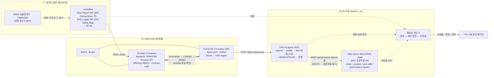

# K-MDS 실증 시나리오 v0.2 — S-1-1 GHG 의무보고 데이터 상호운용성 (TTA 시험용)

- 과제: K-MDS 과제 3차년도 · 작성 2026-09-26 · K-MDS Orchestrator · 상태: **초안(연구책임자 검토 대기)**
- 이전 판: `K-MDS_실증_시나리오_v0.1.md`(전체 조망). 이 문서는 2026-09-26 결정(pm/decisions.md)에 따라 **S-1-1 하나**로 범위를 좁힌 절차서 초안이다.
- 표기: ✅ 확인된 사실 / ⚠ 미확정·미실행 / ❓ 근거 없음(결정 필요). 인프라 주소는 `<K-MDS-IDS-HOST>`로 마스킹.

---

## 0. 확정된 범위 (2026-09-26 결정)

| 항목 | 결정 |
|---|---|
| 우선 시나리오 | **S-1 GHG 환경규제 의무보고**, 단계별 진행. 1단계 = **S-1-1** |
| S-1-1 정의 | 랩오투원 IDS Provider(vessellink, TRIMSSIM Provider API)에 등록된 데이터 → K-MDS IDS Consumer(KR) 수신 → **GHG AI Agent(IMO Compendium 매핑 스킬)로 표준 모델 매핑을 지능화·자동화** → 로컬 docker **data-space(Ship-ODMS, GHG 표준모델 API; KR GEARs 대역)** 전송 → **정합성 확인** |
| 평가 | **TTA 시험(성능목표 #9)만 우선**. ISO/IEC 25023 기반 체크 항목 확정. 1차 범위 = **데이터 정합성 항목만** |
| 제외 | S-2 RIMS 포트콜, S-3 KLNET MSW, 유엔젤 BLUEONE 경유 등록(VDR 항로) |
| 데이터 보강 | 10-14 진도점검에서 KR GHG 데모 → 팬오션·포스에스엠 데이터 활용 요청과 함께 랩오투원 보강 |
| 장소·입회 | RIMS 진해 특수선 센터(시뮬레이터 인프라), TTA 입회 |
| 보류 | C02 결정 D1~D8 → 부록 A에 쉬운 설명, 이후 결정 |

---

## 1. S-1-1 시스템 구성

| # | 블록 | 시스템 | 위치 | 상태 |
|---|---|---|---|---|
| 1 | 데이터 원천 | RIMS 시뮬레이터 / TRIMSSIM 데이터 → **vessellink**(랩오투원 LAB021) Noon Report API(IMO Compendium 키 71종) · DAQ Logger API(ISO 19848 채널 72종), 코드북 공개 | 랩오투원 클라우드 | ✅ 실행 확인(9/12·9/16). 9/16 Noon 이벤트 0건(F-22) ⚠ |
| 2 | IDS Provider | K-MDS Provider Connector(DSC 8.0.2). Backend Connection "TRIMSSIM Provider API"(loggers)·noon. Offering "Noon Report API", "DAQ Logger API"(카탈로그 LAB021), Contract Offer USE 2026-08-03~2030-12-31 | 유엔젤 `<K-MDS-IDS-HOST>` | ✅ |
| 3 | IDS 인프라 | DAPS(CA)·Metadata Broker | 유엔젤 | ✅ 가동 / Broker 등록 Unregistered·검색 500(F-4·F-23) ⚠ |
| 4 | IDS Consumer | K-MDS Consumer Connector(KR). Agreement confirmed(9/10, 9/16). Route "GHG Agent"→`host.docker.internal:8001/api/v1/ids/events`, Route "Ship-ODMS API"→`host.docker.internal:8088/api/ships` | 유엔젤 `<K-MDS-IDS-HOST>` | ✅ 등록됨(Route 실전송 미검증 ⚠) |
| 5 | GHG AI Agent | `k-mds/apps/kr-ghg-ai-agent`: ingress → profile → **IMO Compendium 매핑(결정론+코드북+validator, LLM 후보)** → 검증(FAL50 registry 1,205·코드리스트) → 변환 → 전달. 어댑터 `verification/adapters/{lab021_noon_adapter,gears_voyage_transform}.py` | KR 로컬(:8001) | ✅ 로컬 실행. 실 payload 매핑 70/71(어댑터 규칙 적용 시) |
| 6 | 표준모델 API (GEARs 대역) | **data-space Ship-ODMS**: `/api/ships`, `/ships/{id}/voyages`, `/voyages/{id}/port-calls`, `/voyages/{id}/performance-reports`(+weather·cargo·electric·fuel-consumptions·CO2). 스키마 = `shared/standard-model/openapi.yaml`(IMO ID 주석) | KR 로컬 docker(:8088, Java backend; 프론트 :3030) | ✅ 가동 확인(9/26, /api/ships 200, swagger 200) |
| 7 | 정합성 확인기 | (신규) 원본 ↔ IMO 정준 ↔ data-space 저장값 3자 대조 스크립트 | KR 로컬 | ❓ 작성 필요 |
| 8 | 참조 표준 | IMO Compendium FAL50(FAL.5/Circ.56), ISO 19848:2024, ISO/IEC 25023 | data/raw | FAL50·19848 ✅ / **ISO/IEC 25023 원본 미배치** ❓ |

### 1.1 데이터 흐름도 (S-1-1 범위)

---

## 2. 시험 절차 초안 (Step)

각 Step은 "입력 → 실행 → 기대 결과 → 판정 → 증적" 형식. 현재 확인 상태를 함께 적었다.

| Step | 내용 | 기대 결과 | 증적 | 현재 |
|---|---|---|---|---|
| T0 | 기준선 고정: 시스템 버전(agent commit, validator commit, FAL50 sha256, data-space 이미지/커밋, Connector 버전), 시드 데이터 식별(IMO 00000009 등) | 버전·해시 기록 | baseline.yaml | ✅ 방식 확보(S03 step0) |
| T1 | Provider 등록 확인: Offering·Representation·Artifact·Contract Offer 조회 | LAB021 2건 식별 | ids-description-*.json, UI 캡처 | ✅ |
| T2 | IDS 계약·전송: Consumer가 Description → Contract(USE) → Artifact 수신 | 201 confirmed, 200 payload, **sha256 = 원본** | agreement, artifact, hash | ✅ (9/16) |
| T3 | Consumer → Agent 전달: Route "GHG Agent" dispatch 또는 Artifact 다운로드 후 POST | 202/200, correlation_id, raw-input.sha256 | agent evidence/ | ⚠ Route 실전송 미검증(로컬 :8001 노출 필요) |
| T4 | 표준 매핑(지능화): profile → 코드북·FAL50 규칙·validator·LLM 후보 → IMO Data Number 확정 | 매핑률·미매핑 목록·방법별 건수(결정론/스킬/LLM) | mapping-result.json | ✅ 70/71 (어댑터 규칙), 에이전트 단독은 D2·D4 반영 필요 |
| T5 | 표준 검증: 형식·코드리스트·필수·단위 | validation-result PASS/WARNING/FAIL 건수 | validation-result.json | ✅ |
| T6 | 표준모델 API 전송: IMO 정준 → data-space Ship/Voyage/PortCall/PerformanceReport POST | 201, 저장 id | data-space 응답, DB 조회 | ❓ **변환기 신규 작성 필요**(현 에이전트 출력은 `/data_elements/IMOxxxx` 목록, Ship-ODMS 스키마 아님) |
| T7 | 정합성 확인: 원본 값 ↔ data-space 저장값 필드 단위 대조(단위·형식 변환 규칙 명시) | 정합율 ≥ 목표, 불일치 목록 | consistency-report.json | ❓ 확인기 신규 |
| T8 | 재현: T2~T7 재실행(run+1) 동일 결과, 제3자(TTA) 실행 가능한 스크립트·설정 | 동일 해시·동일 정합율 | run_NN/ | ✅ 방식 확보(run_c02.py) → 확장 |

---

## 3. ISO/IEC 25023 기반 데이터 정합성 체크 항목 (2026-09-26 확정: M4 채택)

표준 원본: `data/raw/ISO25000/ISO_IEC_DIS_25023(E)-Character_PDF_document.pdf` — **ISO/IEC DIS 25023:2014(E)**(Draft International Standard, 한국선급 라이선스본). 인용은 이 문서 기준이며, TTA가 최종본(IS 2016)을 적용하면 측정 ID·문구 재대조가 필요하다(§6 확인 요청).

표준이 정한 표기(§7): 측정 ID = 특성·부특성 약어 + 일련번호 + G(Generic)/S(Specific); 측정함수는 0.0~1.0으로 정규화, 1.0에 가까울수록 좋음(§6.2). 표준 스스로 "사용자가 측정을 수정하거나 목록에 없는 측정을 쓸 수 있으며, 그때는 25010 품질모델과의 관계를 명시"하라고 둔다(§6.2 말미). 아래 M1·M5는 그 조항에 따라 취지를 적용한 것이고, M2·M3·M4는 표준 측정함수를 그대로 쓴다. 데이터 자체의 품질 측정은 표준이 ISO/IEC 25024(Con-I-1)를 가리키므로(8.4.2 NOTE), 25024 적용 여부는 별도 결정.

| 항목 | 25023 측정 | 표준 측정함수(원문) | 이 시나리오의 A·B | 목표 | run_01·02 실측 |
|---|---|---|---|---|---|
| M1 전달 정확성 | CIn-2-G Data exchange protocol conformance (8.4.2, Table 8; 권고 R) — 취지 적용 | X = A/B, A = 지원되는 교환 프로토콜 수, B = 지정된 프로토콜 수 | IDS 프로토콜 경유 수신 Artifact 중 원본과 sha256 동일한 것 / 수신 Artifact | 1.0 | T2: 9/12·9/16 실측 2/2 = 1.0 (러너에서는 자격증명 부재로 NOT_TESTED) |
| M2 표준 매핑 완결성 | FCp-1-G Functional coverage (8.2.1, Table 1) | X = 1 − A/B, A = 누락 함수 수, B = 지정 함수 수 | A = 미매핑 필드, B = 원본 입력 필드(이벤트 12건 합) | ≥ 0.95 | **0.9945** (4/726 미매핑: isEuPort) |
| M3 표준 검증 정확성 | FCr-1-G Functional correctness (8.2.2, Table 2) | X = 1 − A/B, A = 부정확 함수 수, B = 고려 함수 수 | A = validator FAIL 필드, B = 확정 매핑 필드 | 1.0 | **1.0** (0/722) |
| **M4 값 정합성 (채택 정합율)** | FCr-1-G 를 "필드 전달"이라는 기본 기능 단위에 적용(NOTE 3: 함수는 ISO 14143 의 elementary process 일 수 있음) | X = 1 − A/B | A = 원본↔저장값 불일치 필드, B = 표준모델 대응 필드가 있는 원본 필드 | **≥ 0.95** | **0.9854** (5/342 불일치: seaHeight 0.5→0, 정수형 정밀도 G-5) |
| M5 필수 요소 충족 | CIn-1-G Data exchange format conformance (8.4.2, Table 8; 권고 HR) — 취지 적용 | X = A/B, A = 교환 가능한 데이터 형식 수, B = 지정 형식 수 | 스키마 required 충족 필드 / required | — | N/A (Ship-ODMS openapi 에 required 없음) |

값 비교 규칙(T7, `consistency_check.py`): 숫자 상대오차 ≤ 0.1 % 또는 절대차 ≤ 1e-6, 문자열 정확 일치(형 정규화 str() 허용), 시각 UTC 초 단위 일치, 결측(−9999, "")=null. 규칙은 증적(consistency-report.json)에 함께 기록된다.

### 3.1 run_01·run_02 결과 (2026-09-26, 로컬; 증적 `verification/evidence/C02/s11/run_0{1,2}/`)
- 판정 **PASS(T2 NOT_TESTED)**. R-M4·R-M3·R-M2·R-T6(HTTP 오류 0)·R-T5(evidence 무결성)·R-T8(재현성: run_01↔run_02 M2·M3·M4 동일) 전부 충족.
- 매핑 방법: EXPLICIT_IDENTIFIER_VALIDATED 722, UNMAPPED 4 (isEuPort — 코드북이 IMO0856/0857 두 관할코드에 걸리고 값이 boolean). LLM 호출은 미매핑 후보 탐색 시 1회/레코드(mock).
- 검증: PASS 734 / WARNING 195(PROFILE_NOT_APPLICABLE — 선박 일반정보 요소가 Noon 데이터셋 밖, 정책 P-PROFILE-1) / FAIL 0.
- 표준모델에 대응 필드가 없는 IMO 요소 16종(전송 제외, M4 분모 제외): IMO0064·0084·0085·0543(다음항 ETA·코드·명·계획시각), IMO0066·0541(ETD·ETB), IMO0109·0112(항구명), IMO0139·0143·0148(GT·NT·등록항), IMO0452(밸러스트), IMO0548(선석), IMO0580(선장), IMO0666·0667(벙커항).
- 갭: G-1 Ship-ODMS `fuelType` int32 vs FAL50 연료코드 문자열 → `fuelTypeTradeName` 에 코드 저장(WORKAROUND) / G-2 담수·실린더유를 `_NONFUEL` 연료행에 저장 / G-3 IDS Route 는 Artifact 1건=payload 1건이라 러너가 이벤트 단위로 분할 투입 / G-4 Ship-ODMS 백엔드 결함 2건 수정(자식 행 부모참조 누락, 목록 DTO 6필드 누락 — `apps/data-space` 커밋) / G-5 seaHeight 정수형(FAL50 IMO0632 n..2) 정밀도.

---

## 4. S-1-1 착수 전 작업 항목

| # | 작업 | 담당 | 비고 |
|---|---|---|---|
| W1 | ISO/IEC 25023 원본 배치 → §3 항목에 측정 ID·원문 산식 부여, 정합율 확정 | 연구책임자 → 오케스트레이터 | **완료 2026-09-26** (DIS 2014본, M4 채택) |
| W2 | IMO 정준 → data-space 변환기(`verification/adapters/imo_to_shipodms.py`) | 오케스트레이터 | **완료** (T6) |
| W3 | 정합성 확인기(`verification/adapters/consistency_check.py`): 3자 대조, M1~M5 | 오케스트레이터 | **완료** (T7) |
| W4 | GHG Agent에 코드북 규칙 내장(D2·D4·D8): `apps/kr-ghg-ai-agent/src/ghg_agent/adapters/lab021_ingress.py`, 후보집합 0.2.0(159 요소), 컨텍스트 키 확장. 테스트 122 passed | 오케스트레이터 | **완료** |
| W5 | Consumer Route "GHG Agent" 실전송 검증 — 결정: **노트북 로컬 IP(유선 우선)** 를 Route URL 로 등록. 진해 현장 네트워크에서 Connector→노트북 :8001 도달 확인 후 T3 를 Route 경유로 재실행 | KR·유엔젤 | 현장 |
| W6 | Provider 데이터 복구·보강(F-22, 이벤트 0건; F-16 필수 항목) | 랩오투원(10-14 이후) | 없으면 9/12 수신본으로 시험 |
| W7 | TTA와 시험 절차서 형식·증빙 패키지 형식 합의, 25023 적용 판(DIS 2014 vs IS 2016) 확인 | KR·TTA | 미결 |
| W8 | `verification/run_s11.py --run` 원커맨드(T0~T8, run_NN 증가, 재현성 판정) | 오케스트레이터 | **완료** |

---

## 5. 자동화·동영상 (추후 가이드 예고)

- 자동화: T0~T8을 `run_s11.py --run` 한 명령으로 실행해 run_NN/ 아래 증적·판정을 생성(기존 run_c02.py 확장). UI 단계(Consumer UI 계약·다운로드)는 Playwright 스크립트로 캡처 자동화 가능.
- 동영상: 화면 녹화(OBS 또는 Windows 게임 바)로 ① Provider UI Offering ② Consumer UI 계약·다운로드 ③ 에이전트 실행 로그 ④ data-space Swagger에서 저장값 조회 ⑤ 정합성 보고서 순서로 촬영. 자동화 스크립트가 단계마다 콘솔에 헤더를 찍도록 하면 편집 없이 한 테이크로 찍을 수 있다.
- 시점: W2·W3 완성 후.

---

## 부록 A. 보류된 결정 D1~D8 쉬운 설명

배경: S03에서 GHG AI Agent에 실제 랩오투원 데이터를 넣었더니 매핑이 거의 안 됐고, 원인을 나눠 보니 "사람이 정해야 할 것" 8가지가 나왔다. 각각 한 문장 질문 + 권고안.

| D | 질문 | 권고 | 이유 |
|---|---|---|---|
| D1 | 합성 데이터 시험에서, 에이전트가 정상 흐름인데도 오류칸에 "GEARs 계약 미확정"이라고 적는 것을 **오류가 아닌 것으로 봐도 되나?** | 예 | 실제 GEARs 계약이 없다는 표시일 뿐, 매핑·검증은 다 통과. S-1-1은 GEARs 대신 data-space를 쓰므로 이 표시 자체가 사라짐 |
| D2 | 에이전트가 "허용된 표준 항목 목록"을 18개만 갖고 있어 실제 데이터의 43개 항목 대부분을 거부했다. **허용 목록을 코드북 43개로 넓혀도 되나?** | 예 | 안 넓히면 지능화 매핑 시연이 불가. 목록은 랩오투원 코드북이라는 근거가 있음 |
| D3 | 랩오투원 코드북이 한 필드에 표준 항목 2~4개를 걸어 놓아(42/68) 자동 확정이 안 된다. **랩오투원에 1:1로 정리하거나 문맥 규칙을 달아 달라고 요청할까?** | 예(10-14에 병행) | 우리가 만든 규칙(연료 구조·이벤트 문맥)으로 해결은 했지만, 근본은 코드북 |
| D4 | 코드북 규칙 변환기를 **에이전트 안에 넣을까, 랩오투원(ROC) 쪽에서 변환해 보내라고 할까?** | 에이전트 안 | S-1-1 취지가 "에이전트가 지능화 매핑"이므로 |
| D5 | DAQ(ISO 19848 센서 데이터)도 검증 규칙을 정해 시험할까? | 이번엔 보류 | 항차 보고(Noon)만으로 GHG 의무보고 흐름이 성립. DAQ는 S-1-2 후보 |
| D6 | 저황유(VLSFO·ULSFO)를 GEARs 양식의 **HFO 열로 분류해도 되나?** | 예 | FAL50 연료 코드 설명이 "HFO w/ S 0.1~0.5 %". data-space는 연료 코드를 그대로 저장하므로 S-1-1에서는 영향 없음 |
| D7 | 검증 유형을 **IMO DCS(002)만** 할지 EU MRV(001)도 할지 | IMO DCS만 | 시뮬레이터 선박·항로가 EU 무관 |
| D8 | 지금 어댑터에 있는 매핑 규칙을 **에이전트 본체로 옮길까?** | 예 (= D2+D4 실행) | W4 |

D1·D6·D7은 GEARs 전송을 전제로 한 것이라 S-1-1에서는 사실상 소멸하고, **D2·D4·D8(에이전트에 규칙 반영)만 결정하면 W4를 시작할 수 있다.**
